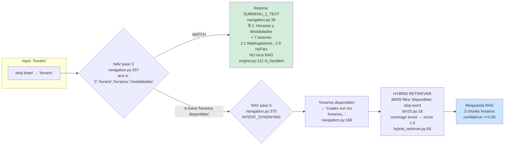
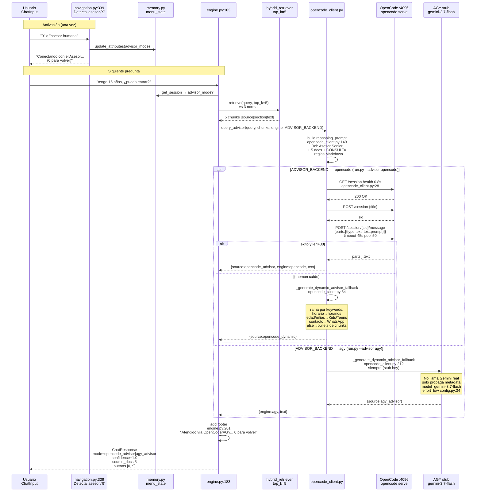

# 📊 Diagrama Completo — Synapse Admissions AI (Nova Idiomas OS '97 v2.6.0)

> Guía visual paso a paso de cómo el bot sabe qué responder. Renderiza este archivo en GitHub, VS Code (Markdown Preview) o https://mermaid.live

---

## 1. Arquitectura por Capas (Vista General)

```mermaid
flowchart TB
    subgraph FE [PRESENTACIÓN — Next.js 15 Frontend :3000]
        A1[Header Retro OS 97]
        A2[PixiParticleBackground<br/>SVG 18 nubes+8 palmas+hierba +<br/>PIXI WebGL 36 partículas<br/>18 fireflies+10 dews+8 spores]
        A3[ChatContainer + ChatInput]
        A4[MetricsModal + CRT Filter]
    end

    subgraph API [API GATEWAY — FastAPI :8000]
        B1[POST /api/v1/chat]
        B2[GET /api/v1/health]
        B3[GET /api/v1/metrics]
        B4[POST /api/v1/escalate]
    end

    subgraph SEC [GUARDRAILS]
        C1[Prompt Injection<br/>guardrails.py:9]
        C2[Length 1000 + Sanitización]
    end

    subgraph NAV [NAVEGACIÓN DETERMINÍSTICA<br/>navigation.py:325]
        D1[Menú 0 Root]
        D2[Pilares 1..4]
        D3[Leaves 1.1..4.6]
        D4[INTENT_SYNONYMS]
    end

    subgraph CACHE [CACHÉ DUAL — ACTIVO]
        E1[Exact SHA-256<br/>cache.py:19 TTL 3600s]
        E2[Semantic 0.95<br/>cache.py:47 cosine<br/>vector_store.embed_query]
    end

    subgraph RAG [HYBRID RAG]
        F1[ChromaDB Dense<br/>vector_store.py:167]
        F2[BM25 Sparse<br/>bm25.py:74 k1=1.5 b=0.75]
        F3[RRF k=60<br/>hybrid_retriever.py:73<br/>+ coverage boost]
    end

    subgraph ADV [ASESOR DUAL]
        G1[OpenCode :4096<br/>opencode_client.py:163]
        G2[AGY Antigravity<br/>gemini-3.7-flash low<br/>opencode_client.py:212]
    end

    FE -->|HTTP JSON| API
    API --> SEC --> NAV --> CACHE --> RAG --> ADV
```



**Capas:** `frontend/src/app/page.tsx` → `backend/src/api/routes.py:35` → `guardrails.py:28` → `navigation.py:325` → `cache.py:19` → `hybrid_retriever.py:18` → `opencode_client.py:127` / `engine.py:220` (escalamiento) / `engine.py:264` (LLM).

---

## 2. Flujo Completo de una Pregunta (End-to-End)

```mermaid
flowchart TD
    START([Usuario escribe<br/>ej: 'horario'<br/>ChatInput.tsx]) --> REQ[POST /api/v1/chat<br/>lib/api.ts:5<br/>next.config.mjs:5 rewrite<br/>→ 127.0.0.1:8000]
    REQ --> ENG[rag_engine.answer_query<br/>engine.py:111]

    ENG --> CHK{BM25 o Chroma<br/>vacíos?<br/>engine.py:123}
    CHK -->|sí| ING[ingestion_pipeline.run<br/>ingestion.py:83<br/>82 docs → 245 chunks<br/>chunk 500 overlap 100<br/>hash dir para invalidar caché]
    CHK -->|no| NAV
    ING --> NAV

    NAV[NAVIGACIÓN<br/>navigation.process_input<br/>navigation.py:325<br/>text.strip.lower] --> NAV1{¿Match?}

    NAV1 -->|text 0 menu inicio| R0[ROOT_MENU_TEXT<br/>navigation.py:5<br/>4 pilares<br/>mode=menu_navigation<br/>engine.py:134<br/>latencia &lt;5ms]
    NAV1 -->|text 1/2/3/4<br/>o 'horario'→'2'| R1[SUBMENU_2_TEXT<br/>navigation.py:36<br/>Horarios<br/>6 opciones 2.1..2.6]
    NAV1 -->|text 1.1..4.6| R2[LEAF_QUERY_MAP<br/>navigation.py:85<br/>ej 1.1→ 'niveles MCER...'<br/>+ get_contextual_buttons]
    NAV1 -->|text en INTENT_SYNONYMS<br/>ej 'horarios disponibles'| R3[Query canónica<br/>navigation.py:163<br/>ej → 'Cuales son los horarios...']
    NAV1 -->|nada| R4[raw_input → RAG<br/>navigation.py:385]

    R0 --> END
    R1 --> G
    R2 --> G
    R3 --> G
    R4 --> G

    G[GUARDRAIL<br/>guardrails.inspect_query<br/>guardrails.py:28] --> G1{¿Seguro?}
    G1 -->|len>1000 o regex<br/>ignore previous / DAN / beca 100%| REF[status=refused<br/>engine.py:152<br/>confidence 0.0]
    G1 -->|sí| CACHE

    CACHE[CACHÉ EXACTA<br/>query_cache.get<br/>cache.py:19<br/>SHA256 lower TTL 3600] --> C1{hit?}
    C1 -->|sí| HIT[cached=true<br/>engine.py:170<br/>&lt;30ms 0 tokens]
    C1 -->|no| RET

    RET[HYBRID RETRIEVER<br/>hybrid_retriever.py:18<br/>top_k=3 candidate 15] --> DENSE[Chroma dense<br/>vector_store.py:167<br/>cosine 1-dist]
    RET --> SPARSE[BM25 sparse<br/>bm25.py:74<br/>stop-words ES+EN<br/>stemming 'horarios→horario']
    DENSE & SPARSE --> FUS[RRF k=60<br/>hybrid_retriever.py:73<br/>score=1/(60+rank)<br/>+ norm_bm= min1 bm/3 * coverage<br/>boost 1.25 si coverage>=0.5<br/>similarity=max dense norm_bm]

    FUS --> ADV_Q{¿advisor_mode?<br/>engine.py:183<br/>menu_state==advisor_mode<br/>o use_opencode_mode}

    ADV_Q -->|sí TOP 5 chunks| ADVISOR[ASESOR DUAL<br/>opencode_client.query_advisor<br/>ver diagrama 4]
    ADVISOR --> RESP

    ADV_Q -->|no| REL{top_similarity >=0.50?<br/>guardrails.py:42<br/>config.py:22}
    REL -->|no| ESC[ESCALAR<br/>dispatcher.create_ticket<br/>dispatcher.py:24<br/>ESC-YYYYMMDD-XXXX<br/>escalations.json<br/>engine.py:220<br/>status=escalated]
    REL -->|sí| PROMPT[build_rag_prompt<br/>prompt_templates.py:48<br/>SYSTEM_PROMPT<br/>+ 3 few-shot<br/>+ chunks [source|section]]

    PROMPT --> LLM{¿LLM key?}
    LLM -->|mock / sin OPENROUTER_KEY| MOCK[Mock grounded<br/>formatea top_chunk<br/>engine.py:28<br/>• bullets]
    LLM -->|openrouter| OPENAI[POST openrouter.ai<br/>hermes-3 8b temp 0.2<br/>engine.py:77]
    MOCK --> SAVE
    OPENAI --> SAVE
    ESC --> SAVE
    ADVISOR --> SAVE
    REF --> SAVE
    HIT --> SAVE

    SAVE[metrics.record +<br/>memory.add + cache.set<br/>engine.py:274-301] --> RESP

    RESP([ChatResponse<br/>schemas.py:13<br/>response + source_docs<br/>confidence + latency_ms<br/>action_buttons<br/>→ react-markdown GFM]) --> END([Render en ChatContainer.tsx])
```

---

## 3. Ejemplo Concreto: si dices "horario"



**Por eso:**
* `horario` singular → **menú 2 instantáneo** (determinístico).
* `horarios disponibles / que horarios hay / a que hora dan clases` → **INTENT_SYNONYMS** `navigation.py:163-175` → query canónica → RAG con alta cobertura.
* Si fallara todo → BM25 stemming `horarios→horario` + Chroma igual encuentra `02_horarios_y_modalidades.md`.

---

## 4. Asesor OpenCode vs AGY (cuando preguntas en modo asesor)



**Switch pre-lanzamiento** `run.py:253`:
* `python run.py --advisor opencode` o menú `[1]` → `ADVISOR_BACKEND=opencode` → `start_opencode()` libera `:4096`.
* `--advisor agy` o `[2]` → `ADVISOR_BACKEND=agy` → no ocupa puerto, usa stub.

Frontend etiqueta burbujas `ASESORÍA (OPENCODE MEMO)` vs `(AGY ANTIGRAVITY MEMO)` por `mode`. Health expone `advisor_engine` `api/routes.py:31`.

---

## 5. Ingestión — Cómo se Indexa el Conocimiento

```mermaid
flowchart LR
    DOCS[82 .md en<br/>backend/data/documents/] --> HASH[compute_directory_hash<br/>ingestion.py:24<br/>sha256 nombres+bytes]
    HASH --> SPLIT[_split_into_chunks<br/>ingestion.py:32<br/>split por ##<br/>ventana 500 char<br/>overlap 100]
    SPLIT --> CHUNKS[245 chunks<br/>id sha256[:16]<br/>metadata source/section]
    CHUNKS --> CHROMA[vector_store.add_documents<br/>vector_store.py:137<br/>Chroma Persistent<br/>all-MiniLM-L6-v2]
    CHUNKS --> BM25[bm25_index.fit<br/>bm25.py:52<br/>inverted index<br/>avg_doc_len]
    CHROMA & BM25 --> READY[Ready<br/>vector_store.count 245<br/>/health: healthy]
    HASH --> CACHE_INV[query_cache.update_hash<br/>cache.py:81<br/>invalida si cambió]
```

Se ejecuta en `main.py:14` `lifespan()` al arrancar y bajo demanda si `count==0` `engine.py:124`.

---

## 6. Leyenda de Archivos Clave

| Componente | Archivo : Línea |
|---|---|
| API Chat | `backend/src/api/routes.py:35` |
| Motor RAG | `backend/src/rag/engine.py:111` |
| Navegación | `backend/src/core/navigation.py:325` |
| Guardrails | `backend/src/core/guardrails.py:9` |
| Caché | `backend/src/core/cache.py:19` |
| Hybrid RRF | `backend/src/rag/hybrid_retriever.py:18` |
| BM25 | `backend/src/rag/bm25.py:74` |
| VectorStore | `backend/src/rag/vector_store.py:167` |
| Asesor | `backend/src/core/opencode_client.py:127` |
| Prompt | `backend/src/rag/prompt_templates.py:48` |
| Ingestión | `backend/src/rag/ingestion.py:32` |
| Frontend API | `frontend/src/lib/api.ts:5` |
| Página | `frontend/src/app/page.tsx:1` |

---

## Cómo Ver los Diagramas

1. **GitHub:** este `.md` renderiza Mermaid automáticamente.
2. **VS Code:** `Ctrl+Shift+V` (Preview) con extensión `Markdown Preview Mermaid Support`.
3. **Online:** copiar bloque ```mermaid en https://mermaid.live → Export PNG/SVG.

> Generado 2026-09-01 — Para defensa oral, imprime sección 2 y 4 en 1 slide cada una.
