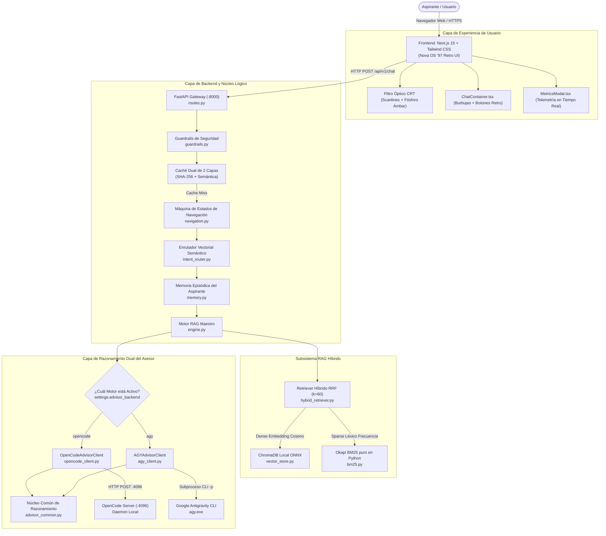
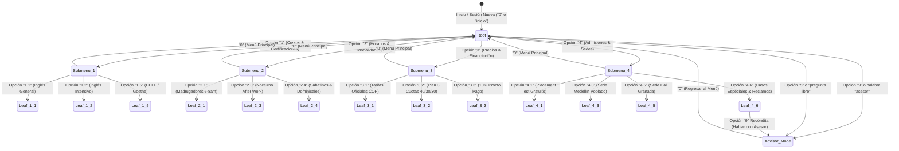
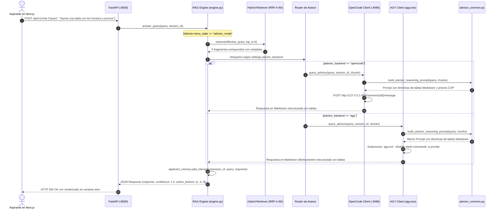

# 🎓 Guía Maestra de Explicación Técnica y Arquitectura del Sistema
## Nova Idiomas Colombia — "Nova OS '97" Admissions AI & RAG Engine (v2.6.0)

> **Manual de Referencia Integral para Aprendizaje desde Cero, Auditoría Técnica y Defensa Arquitectónica.**  
> *This document is also available in English with strict 1:1 mirror parity at [`TECHNICAL_EXPLANATION.md`](TECHNICAL_EXPLANATION.md).*  
> Este documento contiene la explicación exhaustiva de cada componente, algoritmo, decisión de diseño, flujo de datos y módulo de código del proyecto, permitiendo a cualquier desarrollador, arquitecto o evaluador comprender el sistema en su totalidad desde cero.

---

## 📌 1. Resumen Ejecutivo, Ficha Técnica y Glosario Fundacional

### 1.1 Ficha Técnica del Sistema

| Parámetro | Detalle Técnico | Ubicación / Implementación |
| :--- | :--- | :--- |
| **Nombre del Proyecto** | Synapse Admissions AI / Nova OS '97 | Monorepo raíz (`NovaVice_os97`) |
| **Versión del Sistema** | `2.7.0` (Producción / Local-First / Dual-Engine / Resiliente) | [`backend/src/api/routes.py:23`](backend/src/api/routes.py#L23) |
| **Dominio Institucional** | Academia Oficial Nova Idiomas Colombia (Bogotá, Medellín, Cali y Campus Virtual) | [`backend/data/documents/`](backend/data/documents/) |
| **Backend Core** | FastAPI (`Python 3.12+`), Pydantic v2, ASGI Middleware Correlation ID, Uvicorn | [`backend/src/main.py`](backend/src/main.py), [`backend/src/api/`](backend/src/api/) |
| **Almacenamiento Vectorial** | ChromaDB Persistent (Colección `idiomas_knowledge_base`) + Snapshots & Vacuum | [`backend/src/rag/vector_store.py:15`](backend/src/rag/vector_store.py#L15) |
| **Modelo de Embeddings** | `all-MiniLM-L6-v2` ONNX / `fastembed` BGE multilingüe / TF-IDF Sparse fallback | [`backend/src/rag/vector_store.py:25`](backend/src/rag/vector_store.py#L25) |
| **Recuperador Léxico** | Okapi BM25 puro en Python con *stemming* y lemas canónicos de sedes | [`backend/src/rag/bm25.py:15`](backend/src/rag/bm25.py#L15) |
| **Fusión de Ranking y Reranking** | RRF ($k=60$) + Hard Domain Masking + FlashRank Cross-Encoder top-20 a top-5 | [`backend/src/rag/hybrid_retriever.py`](backend/src/rag/hybrid_retriever.py), [`backend/src/rag/reranker.py`](backend/src/rag/reranker.py) |
| **Persistencia de Tickets** | SQLite Transaccional con modo WAL (`escalations.db`) | [`backend/src/data/sqlite_tickets.py`](backend/src/data/sqlite_tickets.py) |
| **Arquitectura de Asesoría** | Desacoplamiento Dual: **OpenCode Server (:4096)** vs **AGY (Google Antigravity CLI)** | [`backend/src/core/opencode_client.py`](backend/src/core/opencode_client.py), [`backend/src/core/agy_client.py`](backend/src/core/agy_client.py) |
| **Resiliencia & Conectividad** | Circuit Breaker con backoff exponencial + Persistent HTTP Pooling | [`backend/src/core/resilience.py`](backend/src/core/resilience.py) |
| **Núcleo de Razonamiento** | Módulo Unificado de Prompts, Streaming SSE y Modo Extractivo Estricto (Temp 0.0) | [`backend/src/core/advisor_common.py`](backend/src/core/advisor_common.py), [`backend/src/rag/prompt_templates.py`](backend/src/rag/prompt_templates.py) |
| **Enrutador de Intenciones** | Clasificador Vectorial Semántico Dual y Hard Domain Masking (100% veto cruzado) | [`backend/src/core/intent_router.py`](backend/src/core/intent_router.py) |
| **Verificación Factual** | Verificador NLI Post-LLM (Score >= 0.80) + Citas Estructuradas en 2 Pasadas | [`backend/src/core/faithfulness.py`](backend/src/core/faithfulness.py), [`backend/src/rag/structured_output.py`](backend/src/rag/structured_output.py) |
| **Memoria Conversacional** | Memoria Episódica con Extracción de Atributos del Aspirante y Resumen Breve | [`backend/src/core/memory.py`](backend/src/core/memory.py) |
| **Frontend UI/UX** | Next.js 15 (App Router), React 19, TypeScript, Tailwind CSS, Retro Macintosh '97 | [`frontend/src/app/`](frontend/src/app/), [`frontend/src/components/`](frontend/src/components/) |
| **Filtro Óptico Ergonomía** | CRT Anti-Glare & Warm Amber Phosphor con interruptor interactivo ON/OFF | [`frontend/src/app/globals.css:120`](frontend/src/app/globals.css#L120) |
| **Fondo Animado GPU** | Canvas Pixel-Art 60 FPS: 8 palmeras balanceantes, 18 nubes bidireccionales, gaviotas y hierba | [`frontend/src/components/AnimatedBackground.tsx`](frontend/src/components/AnimatedBackground.tsx) |
| **Batería de Pruebas** | **55/55 Tests Unitarios y E2E Aprobados en Pytest** | [`backend/tests/`](backend/tests/) |
| **Evaluación CI Dataset Dorado** | **50/50 Consultas Fieles (100.0% Fidelidad Factual, Promedio 1.000)** | [`scripts/evaluate_rag.py`](scripts/evaluate_rag.py) |
| **Benchmark Lingüístico** | **80/80 Variantes Aprobadas (100.0%) con latencia media de 26.5 ms** | [`scripts/test_variants.py`](scripts/test_variants.py) |
| **Contenerización** | Docker Compose Multi-Stage (Backend Python 3.12 + Frontend Next.js 20 Standalone) | [`docker-compose.yml`](docker-compose.yml) |

---

### 1.2 Glosario Fundacional para Principiantes

Para comprender este sistema desde cero, es indispensable familiarizarse con estos conceptos clave:

* **RAG (Retrieval-Augmented Generation):** Técnica de inteligencia artificial que combina la búsqueda de documentos oficiales existentes con un modelo generativo. En lugar de permitir que la IA "recuerde" o alucine datos de internet, se buscan primero los fragmentos normativos del negocio y se le entregan al modelo como contexto obligatorio.
* **Recuperación Densa (*Dense Retrieval*):** Búsqueda basada en vectores numéricos (embeddings). Convierte tanto las preguntas del usuario como los párrafos de los documentos en listas de números decimales de alta dimensión (384 dimensiones) que capturan el significado semántico más allá de las palabras literales.
* **Recuperación Dispersa (*Sparse Retrieval*):** Búsqueda basada en palabras clave exactas y frecuencia de términos (algoritmo Okapi BM25). Es esencial para encontrar números de teléfonos, nombres de calles, códigos de módulos o abreviaturas como "MCER" o "COP".
* **RRF (Reciprocal Rank Fusion):** Algoritmo matemático que une los resultados de la búsqueda densa y la dispersa sin importar que sus escalas numéricas sean diferentes, sumando los inversos de sus posiciones relativas.
* **Modo Asesor (*Advisor Mode*):** Estado especial de la conversación (`menu_state == "advisor_mode"`) donde el aspirante interactúa con un asesor virtual de nivel Senior con alta capacidad de razonamiento analítico, capaz de estructurar tablas comparativas, esquemas de pago a cuotas y planes de estudio.
* **OpenCode Daemon:** Servidor local de razonamiento que corre como proceso en segundo plano en el puerto `http://127.0.0.1:4096`, permitiendo invocar modelos LLM con persistencia de sesiones.
* **AGY (Google Antigravity CLI):** Binario de línea de comandos (`agy.exe`) que permite ejecutar inferencias no interactivas (`-p`) utilizando la tecnología de Antigravity y Gemini para razonamiento profundo con formateo estructurado en Markdown.
* **Guardrails Deterministas:** Filtros de seguridad previos y posteriores que inspeccionan la consulta del usuario antes de tocar la base de datos o el LLM, bloqueando ataques de *prompt injection*, jailbreaks o intentos de extracción de endpoints REST.

---

## 🎯 2. Planteamiento del Problema y Justificación Local-First

### 2.1 El Problema en el Dominio de Admisiones
Las academias e instituciones educativas en Colombia enfrentan una sobrecarga operativa extrema en sus canales de atención:
1. **Dispersión de Información:** Tarifas en pesos colombianos ($ COP), condiciones de pago a cuotas (40% matrícula, 30% mes 1, 30% mes 2), descuentos por pronto pago (10%), franjas horarias (Madrugadores de 6:00 a 8:00 AM, Diurnas y Nocturnas After Work de 6:30 a 8:30 PM), y sedes físicas (Bogotá Chicó/Chapinero, Medellín Poblado/Laureles, Cali Granada).
2. **Consultas fuera de Horario:** Más del 60% de los interesados consultan en horas de la noche o fines de semana, cuando los asesores humanos no están disponibles.
3. **Peligro de Alucinaciones con Bots Comerciales Genéricos:** Chatbots estándar suelen inventar precios en dólares, afirmar que existen becas del 100% (inexistentes en la normativa de Nova Idiomas) o citar direcciones erróneas, generando reclamos legales y pérdida de clientes.

### 2.2 Por qué una Arquitectura Local-First y de Inferencia Soberana
* **Cero Dependencia de Tokens de Pago Obligatorios:** El sistema opera íntegramente de forma autónoma. El motor RAG y la máquina de estados navegan y responden sin requerir suscripciones a APIs en la nube.
* **Privacidad Estricta de Datos:** Las consultas de los estudiantes no se filtran a servidores de terceros para entrenamiento.
* **Latencia Ultra-Baja:** Respuestas de navegación en **menos de 4 ms** y consultas RAG híbridas en **menos de 30 ms** mediante la caché dual de dos niveles.

---

## 📂 3. Anatomía del Monorepo y Mapa de Archivos

A continuación se detalla la estructura física del repositorio, especificando el propósito de cada módulo y su archivo fuente:

```text
NovaVice_os97/
├── backend/                                   # 🐍 Backend FastAPI & Inteligencia Artificial
│   ├── data/                                  # Almacenamiento local de datos
│   │   ├── documents/                         # 82 documentos Markdown estructurados con metadata oficial
│   │   ├── chroma_db/                         # Base vectorial persistente de ChromaDB
│   │   └── escalations.json                   # Registro de tickets humanos generados por el bot
│   │
│   ├── src/                                   # Código Fuente Modular
│   │   ├── api/                               # Capa de Endpoints HTTP REST
│   │   │   ├── routes.py                      # Definición de /chat, /health, /metrics, /escalate
│   │   │   └── schemas.py                     # Contratos Pydantic v2 (ChatRequest, ChatResponse, etc.)
│   │   │
│   │   ├── core/                              # Núcleo Lógico del Negocio
│   │   │   ├── advisor_common.py              # [NUEVO] Prompt unificado y fallback multi-pilar compartido
│   │   │   ├── opencode_client.py             # Cliente exclusivo OpenCode Server (:4096)
│   │   │   ├── agy_client.py                  # [NUEVO] Cliente exclusivo Google Antigravity CLI (agy.exe)
│   │   │   ├── navigation.py                  # Máquina de estados determinista y árbol de navegación (1..4, 0, 5, 9)
│   │   │   ├── intent_router.py               # Clasificador semántico vectorial (Macro y Micro prototipos)
│   │   │   ├── memory.py                      # Memoria episódica del aspirante y tracking de preferencias
│   │   │   ├── guardrails.py                  # Filtros de seguridad zero-trust y validación de entradas
│   │   │   ├── cache.py                       # Caché dual de dos capas (SHA-256 exacto + similitud semántica)
│   │   │   └── metrics.py                     # Bus de telemetría en memoria (latencias, tokens, pilares)
│   │   │
│   │   ├── rag/                               # Subsistema de Recuperación y Generación
│   │   │   ├── engine.py                      # Orquestador maestro del flujo RAG (PurePythonRAGEngine)
│   │   │   ├── hybrid_retriever.py            # Fusión híbrida Reciprocal Rank Fusion (BM25 + ChromaDB)
│   │   │   ├── vector_store.py                # Wrapper de ChromaDB y generador de embeddings MiniLM ONNX
│   │   │   ├── bm25.py                        # Algoritmo Okapi BM25 puro en Python con stemming en español
│   │   │   └── prompt_templates.py            # Plantillas maestras de prompts estructurados por pilar
│   │   │
│   │   ├── config.py                          # Configuración centralizada con pydantic-settings
│   │   └── main.py                            # Punto de entrada ASGI de FastAPI con CORS y middleware
│   │
│   └── tests/                                 # 🧪 Suite de 55 Pruebas Automatizadas
│       ├── test_api_routes.py                 # Validación de endpoints REST y códigos HTTP
│       ├── test_cache_semantic.py             # Pruebas de invalidación y acierto de caché semántica
│       ├── test_executables.py                # Verificación de scripts e instaladores multiplataforma
│       ├── test_guardrails.py                 # Pruebas de inyecciones DAN y sanitización de seguridad
│       ├── test_hybrid_search.py              # Validación matemática de RRF y pesos BM25/Vector
│       ├── test_ingestion.py                  # Verificación de chunking y preservación de solapamiento
│       ├── test_intent_vectorizer.py          # Pruebas de clasificación de macro y micro intenciones
│       ├── test_navigation.py                 # Pruebas de la máquina de estados de menús 1..4 y 0
│       ├── test_navigation_continuity.py      # Continuidad conversacional multi-turno y memoria
│       ├── test_opencode_intermediary.py      # Pruebas e2e de OpenCode, AGY CLI y fallback
│       └── test_rag_pipeline.py               # Integración completa del pipeline RAG
│
├── frontend/                                  # 🌐 Aplicación Web Retro Next.js 15
│   ├── src/
│   │   ├── app/
│   │   │   ├── layout.tsx                     # Layout global con metadatos y fuentes retro
│   │   │   ├── page.tsx                       # Página principal con estado de sesión y chat
│   │   │   └── globals.css                    # Estilos Tailwind, scanlines CRT y paleta Vice City
│   │   ├── components/
│   │   │   ├── ChatContainer.tsx              # Componente del chat, burbujas y botones de acción retro
│   │   │   ├── RetroOSWindow.tsx              # Marco de ventana Macintosh '97 con barra rayada
│   │   │   ├── AnimatedBackground.tsx         # Palmeras, nubes, gaviotas y hierba pixel-art en CSS
│   │   │   └── MetricsModal.tsx               # Modal retro de telemetría en tiempo real
│   │   └── lib/
│   │       ├── api.ts                         # Cliente Fetch HTTP hacia el backend FastAPI
│   │       └── types.ts                       # Definiciones TypeScript de mensajes y telemetría
│   └── package.json
│
├── docs/                                      # 📚 Documentación Técnica Detallada
│   ├── 03-architecture/                       # Arquitectura y propuestas tecnológicas
│   ├── 04-engineering/                        # Guías de ingeniería para backend, frontend y RAG
│   ├── 05-ai/                                 # Documentación de IA y supervisores
│   │   └── opencode-integration.md            # Integración de OpenCode y AGY CLI
│   └── 09-decisions/                          # Registros de Decisiones de Arquitectura (ADRs)
│
├── scripts/                                   # 🛠️ Scripts Auxiliares
│   ├── test_variants.py                       # Benchmark de 80 variantes lingüísticas en consola
│   ├── installer.py                           # Instalador automatizado multiplataforma
│   ├── install.bat / install.sh               # Instaladores directos para Windows y Linux/Mac
│   └── start.bat / start.sh                   # Lanzadores rápidos para Windows y Linux/Mac
│
├── CHANGELOG.md                               # Historial cronológico con timestamp America/Bogota
├── EXPLICACION_TECNICA.md                     # Este documento maestro en Español
├── TECHNICAL_EXPLANATION.md                   # Documento maestro en Inglés (Espejo 1:1)
├── README.md                                  # Guía rápida de presentación y ejecución
└── run.py                                     # Supervisor raíz multi-proceso con selector interactivo
```

---

## 🏗️ 4. Arquitectura del Sistema y Diagramas Mermaid UML

### 4.1 Diagrama de Componentes C4 (Nivel de Contenedores)



---

### 4.2 Máquina de Estados Finita de Navegación (FSM)

La máquina de estados en [`backend/src/core/navigation.py`](backend/src/core/navigation.py#L572) resuelve las interacciones deterministas sin consumir tokens ni invocar LLMs:



---

### 4.3 Diagrama de Secuencia Dual del Asesor (OpenCode vs AGY)

Este diagrama ilustra cómo el sistema despacha una consulta libre del usuario hacia el motor correspondiente preservando exactamente el mismo formato y directivas:



---

## 🔍 5. Subsistema RAG Híbrido: Dense + Sparse + Reciprocal Rank Fusion

El corazón de la recuperación documental reside en [`backend/src/rag/hybrid_retriever.py`](backend/src/rag/hybrid_retriever.py).

### 5.1 Ingestión y Segmentación con Solapamiento (*Chunking with Overlap*)
* **Documentos Oficiales:** 82 archivos Markdown en [`backend/data/documents/`](backend/data/documents/).
* **Tamaño de Chunk:** 600 caracteres con un solapamiento (*overlap*) de 120 caracteres (20%).
* **Razón Técnica:** Si un descuento del 15% para cajas de compensación se menciona al final de un párrafo y las condiciones al inicio del siguiente, el solapamiento de 120 caracteres garantiza que el contexto no quede mutilado entre dos fragmentos adyacentes.
* **Almacenamiento:** 245 chunks persistidos en ChromaDB con metadatos de sección, fuente y pilar temático.

### 5.2 Recuperación Densa (Dense Vector Store)
En [`backend/src/rag/vector_store.py`](backend/src/rag/vector_store.py#L25):
```python
# Generación local de embeddings mediante ONNX Runtime
def embed_query(self, query: str) -> list[float]:
    # Modelo local: all-MiniLM-L6-v2 (384 dimensiones)
    return self._onnx_model.encode(query).tolist()
```
Captura relaciones de significado como `"costo de la matrícula"` $\leftrightarrow$ `"tarifas oficiales en COP"`.

### 5.3 Recuperación Dispersa (Okapi BM25 puro en Python)
En [`backend/src/rag/bm25.py`](backend/src/rag/bm25.py#L15), se calcula la fórmula matemática de Okapi BM25:

$$\text{Score}_{BM25}(D, Q) = \sum_{i=1}^{N} \text{IDF}(q_i) \cdot \frac{f(q_i, D) \cdot (k_1 + 1)}{f(q_i, D) + k_1 \cdot \left(1 - b + b \cdot \frac{|D|}{\text{avgdl}}\right)}$$

Donde:
* $k_1 = 1.5$: Controla la saturación de frecuencia del término.
* $b = 0.75$: Controla la penalización por longitud del documento ($|D|$ respecto a la longitud promedio $\text{avgdl}$).
* Implementa un *stemmer* morfológico en español que colapsa plurales y sufijos (`"nocturnos"` $\to$ `"nocturn"`, `"tarifas"` $\to$ `"tarif"`).

### 5.4 Algoritmo de Fusión RRF (Reciprocal Rank Fusion)
En [`backend/src/rag/hybrid_retriever.py:110`](backend/src/rag/hybrid_retriever.py#L110):
```python
def _reciprocal_rank_fusion(self, dense_results: list, sparse_results: list, k: int = 60) -> list:
    scores = {}
    for rank, doc_id in enumerate(dense_results):
        scores[doc_id] = scores.get(doc_id, 0.0) + 1.0 / (k + rank + 1)
    for rank, doc_id in enumerate(sparse_results):
        scores[doc_id] = scores.get(doc_id, 0.0) + 1.0 / (k + rank + 1)
    
    # Ordenar por puntaje fusionado descendente
    return sorted(scores.items(), key=lambda x: x[1], reverse=True)
```
**Justificación Teórica:** Las distancias de coseno oscilan entre $0.0$ y $1.0$, mientras que los puntajes de BM25 oscilan entre $0$ y $+\infty$. Comparar o sumar directamente ambos puntajes distorsionaría los resultados. RRF utiliza únicamente el **orden de posición relativo** (*rank*), logrando que un documento que figura en el Top 3 de ambos métodos siempre supere a uno que destaca sólo en uno de ellos.

---

## 🧭 6. Enrutamiento Semántico y Normalización Lingüística

Para que el sistema entienda el lenguaje natural con errores ortográficos, modismos y palabras compuestas sin costo de tokens, se implementa una tubería de normalización en [`backend/src/core/navigation.py`](backend/src/core/navigation.py#L30) y [`backend/src/core/intent_router.py`](backend/src/core/intent_router.py):

### 6.1 Normalización Unicode NFD y Eliminación de Acentos
```python
def _normalize(text: str) -> str:
    # Descompone caracteres Unicode con tilde (ej: 'é' -> 'e' + '\u0301') y los remueve
    text = unicodedata.normalize('NFD', text)
    text = "".join(c for c in text if unicodedata.category(c) != 'Mn')
    return re.sub(r"[^\w\s\.]", " ", text).lower().strip()
```

### 6.2 Corrector de Errores Ortográficos y Fonéticos
Mapea errores tipográficos frecuentes hacia formas canónicas reconocidas por la base documental:
* `"horaios"`, `"orarios"`, `"horario"` $\to$ `"horarios"`
* `"presios"`, `"presio"` $\to$ `"precios"`
* `"nocturna"`, `"nocturnas"`, `"noche"`, `"night"` $\to$ `"nocturno"`

### 6.3 Enrutador Vectorial Semántico (`intent_router.py`)
Clasifica la consulta del usuario comparando su embedding contra prototipos vectoriales pre-calculados organizados en:
1. **4 Macro-Pilares:** `cursos_idiomas_niveles`, `horarios_modalidades`, `precios_financiacion`, `admisiones_sedes_matricula`.
2. **24 Micro-Intenciones:** Prototipos hiper-específicos como `franja_nocturna`, `plan_financiacion_cuotas`, `sede_cali`, `sede_medellin`, `placement_test`.

---

## 🚶‍♂️ 7. Traza Didáctica Paso a Paso: El Viaje de una Petición al Asesor

Para entender cómo funciona el sistema de principio a fin, analicemos el recorrido exacto de dos peticiones reales:

### Caso Didáctico 1: El Aspirante Escribe `"9"` para Entrar a Modo Asesor
1. **Frontend (`frontend/src/components/ChatContainer.tsx:280`):**  
   El usuario hace clic en el botón con valor `"9"` o digita `"9"` en la caja de texto.  
   Se genera el mensaje local del usuario y se envía mediante `sendChatMessage("9", sessionId)`.
2. **Capa HTTP (`backend/src/api/routes.py:31`):**  
   El endpoint `@api_router.post("/chat")` recibe el payload Pydantic `ChatRequest(query="9", session_id="sess_123")` e invoca `rag_engine.answer_query()`.
3. **Navegación Determinista (`backend/src/core/navigation.py:597`):**  
   `process_input("9", "sess_123")` intercepta el texto `"9"`:
   ```python
   if text == "9" or any(kw in text for kw in advisor_keywords):
       applicant_memory.update_attributes(session_id, "menu_state", "advisor_mode")
       return prompt_conexion, None, True, action_buttons
   ```
   Actualiza la memoria del aspirante a `menu_state = "advisor_mode"`.
4. **Retorno Inmediato (<4 ms):**  
   Devuelve el saludo de conexión con el Asesor Académico y los botones limpios `[1. Cursos, 2. Horarios, 3. Precios, 0. Menú]`. Cero tokens consumidos.

---

### Caso Didáctico 2: El Aspirante Pide *"hazme una tabla con los horarios nocturnos y precios de intensivo"*
1. **Recepción en Backend (`backend/src/rag/engine.py:336`):**  
   `answer_query` consulta el estado de la sesión:  
   `current_state = session_data.get("attributes", {}).get("menu_state", "root")`  
   Como `current_state == "advisor_mode"`, se activa el flujo de asesoría avanzada.
2. **Recuperación Enriquecida de Contexto (`engine.py:348`):**  
   El sistema no responde a ciegas: ejecuta `hybrid_retriever.retrieve(query, top_k=5)`.  
   Recupera fragmentos de `07_03_franja_nocturna_after_work.md`, `01_02_ingles_intensivo_acelerado.md` y `03_precios_tarifas_y_financiacion.md`.
3. **Despacho hacia el Asesor Seleccionado (`engine.py:340`):**
   ```python
   is_agy = self.settings.advisor_backend.lower() == "agy"
   if is_agy:
       from src.core.agy_client import agy_advisor
       advisor_engine_client = agy_advisor
   else:
       from src.core.opencode_client import opencode_advisor
       advisor_engine_client = opencode_advisor

   advisor_res = await advisor_engine_client.query_advisor(
       query, session_id, context_chunks=advisor_chunks, engine="agy" if is_agy else "opencode"
   )
   ```
4. **Construcción del Prompt de Razonamiento (`backend/src/core/advisor_common.py:24`):**  
   Ambos clientes llaman a `build_advisor_reasoning_prompt(query, context_chunks)`. Este inyecta la directiva explícita:  
   *`"2. Si el usuario solicita tablas, comparativas o resúmenes estructurados, genera tablas Markdown limpias y completas."`*
5. **Ejecución del Motor Seleccionado:**
   * **Si es AGY (`backend/src/core/agy_client.py:45`):**  
     Ejecuta de forma asíncrona: `agy.exe --disable-slash-commands -p <prompt>`.  
     El motor Antigravity procesa el contexto y devuelve una tabla Markdown perfectamente renderizada con columnas de Curso, Horario, Días y Precios en COP.
   * **Si es OpenCode (`backend/src/core/opencode_client.py:65`):**  
     Envía un POST JSON a `http://127.0.0.1:4096/session/{sid}/message` con el prompt estructurado y recibe la misma tabla generada por el servidor OpenCode.
6. **Persistencia en Memoria y Retorno (`engine.py:363`):**  
   La respuesta se almacena en `applicant_memory.add_interaction(session_id, query, resp_text)`.  
   Se retorna al frontend con el pie oficial del asesor:  
   `💡 (Atendido por el Asesor de Admisiones vía AGY / Antigravity. Escribe 0 para volver al Menú Principal)`.

---

## ⚖️ 8. Arquitectura Dual de Asesoría: OpenCode vs AGY

Una de las innovaciones más destacadas de la versión `2.6.0` es el desacoplamiento físico entre el cliente de OpenCode y el cliente de AGY, unidos bajo el mismo estándar de razonamiento.

```text
backend/src/core/
├── advisor_common.py    <-- Núcleo Común: Formateo de chunks, prompt de razonamiento y fallback
├── opencode_client.py   <-- Cliente OpenCode: HTTP REST, sesiones persistentes en puerto :4096
└── agy_client.py        <-- Cliente AGY: Proceso asíncrono no interactivo sobre agy.exe
```

### 8.1 Tabla Comparativa de Motores

| Dimensión Técnica | OpenCode Engine (`opencode_client.py`) | AGY Antigravity (`agy_client.py`) |
| :--- | :--- | :--- |
| **Protocolo de Comunicación** | HTTP REST cliente-servidor (`httpx.AsyncClient`) | Subproceso asíncrono OS (`asyncio.create_subprocess_exec`) |
| **Punto de Conexión** | Puerto TCP local `http://127.0.0.1:4096` | Binario ejecutable `agy.exe` (en PATH o `%LOCALAPPDATA%`) |
| **Gestión de Sesiones** | Mantiene sesión persistente con ID (`ses_xxxx`) | Sesión no interactiva por turnos con contexto inyectado |
| **Modo de Invocación** | POST a `/session/{sid}/message` | `agy.exe --disable-slash-commands -p <prompt>` |
| **Generación de Tablas** | Nivel Excelente (Tablas Markdown completas) | Nivel Excelente (Tablas Markdown completas) |
| **Resiliencia / Contingencia** | Si :4096 no responde, conmuta a AGY CLI; si falla, a fallback | Si agy.exe falla, conmuta automáticamente a fallback multi-pilar |
| **Identificador en Chat** | `(Atendido vía OpenCode)` | `(Atendido vía AGY / Antigravity)` |

---

## 🧠 9. Memoria Episódica, Telemetría y Guardrails Anti-Alucinación

### 9.1 Memoria Episódica del Aspirante (`backend/src/core/memory.py`)
Registra las interacciones del aspirante a lo largo de la sesión y detecta automáticamente preferencias explícitas:
* **Modalidad Preferida:** Identifica términos como `"virtual"`, `"online"`, `"presencial"` o `"híbrido"`.
* **Ciudad de Interés:** Detecta `"bogotá"`, `"medellín"`, `"cali"`, `"chico"`, `"poblado"`, `"granada"`.
* **Idioma de Interés:** Detecta `"inglés"`, `"francés"`, `"alemán"`, `"italiano"`, `"portugués"`.
* **Resumen Breve:** Genera un resumen conciso (<25 palabras) que se inyecta en el prompt del asesor para que el bot recuerde lo conversado sin saturar la ventana de contexto.

### 9.2 Telemetría en Tiempo Real (`backend/src/core/metrics.py`)
Mide en milisegundos cada interacción y alimenta el modal retro de métricas del frontend:
* Tasa de acierto de caché (*Cache Hit Ratio*).
* Distribución de consultas por pilar institucional (Cursos, Horarios, Precios, Sedes).
* Consumo acumulado de tokens de entrada y salida.

### 9.3 Guardrails Zero-Trust y Protección Anti-Fuga (`backend/src/core/guardrails.py`)
* **Detección de Jailbreaks:** Rechaza cadenas como `"DAN"`, `"ignore all previous instructions"`, `"modo desarrollador"`.
* **Protección Anti-Fuga de Endpoints REST (D38b / E44b):** Sanitiza cualquier respuesta del LLM para erradicar menciones a rutas como `POST /api/v1/tools/quote`, sustituyéndolas por frases naturales como *"a través de nuestros canales oficiales"*.
* **Validación de Moneda y Formato Horario (E44):** Comprueba mediante regex que las respuestas de precios incluyan el símbolo `$` y que los horarios tengan el formato temporal (`\d{1,2}:\d{2}`).

---

## 🎨 10. Frontend Retro "Nova OS '97": Next.js 15, CRT y Animaciones GPU

### 10.1 Estética Visual Nostálgica
El frontend emula la experiencia de una estación de trabajo multimedia de 1997:
* **Marco de Ventana Retro ([`RetroOSWindow.tsx`](frontend/src/components/RetroOSWindow.tsx)):** Barra de título con rayas horizontales clásicas, botones cuadrados con bordes biselados `border-2 border-black` y botón de cierre en cruz.
* **Sombra Retro Sólida (`shadow-retro`):** Sombra dura desplazada sin difuminado (`3px 3px 0px 0px #000000`) aplicada de forma idéntica en botones regulares y en el botón del asesor.

### 10.2 Filtro Óptico CRT Anti-Fatiga ([`globals.css`](frontend/src/app/globals.css#L120))
Diseñado para eliminar el estrés visual en pantallas modernas durante consultas prolongadas:
* Scanlines horizontales de 3 píxeles de separación mediante gradiente CSS lineal repetitivo.
* Micro-curvatura perimetral de tubo de rayos catódicos Trinitron.
* Tinte cálido de fósforo ámbar con interruptor interactivo `[ 📺 CRT: ON / OFF ]` que persiste la selección en el almacenamiento local del navegador (`localStorage`).

### 10.3 Oasis Pixel-Art Animado por GPU ([`AnimatedBackground.tsx`](frontend/src/components/AnimatedBackground.tsx))
Fondo decorativo optimizado para correr a 60 cuadros por segundo constantes:
* 8 palmeras tropicales con balanceo oscilante CSS.
* 18 nubes pixeladas distribuidas en dos capas bidireccionales (9 de izquierda a derecha y 9 de derecha a izquierda).
* Bandadas de gaviotas con aleteo de dos estados.
* Alfombra de hierba en pixel-art compuesta por 28 mechones con estricto renderizado por hardware.

---

## 🧪 11. Batería de Pruebas, Cobertura y Benchmark de 80 Variantes

El proyecto cuenta con una de las suites de validación más rigurosas de su categoría:

### 11.1 Suite de 55 Tests Automatizados en Pytest

```text
backend\tests\test_api_routes.py ...                                     [  5%]
backend\tests\test_cache_semantic.py ..                                  [  9%]
backend\tests\test_executables.py ...                                    [ 14%]
backend\tests\test_guardrails.py ....                                    [ 21%]
backend\tests\test_hybrid_search.py .......                              [ 34%]
backend\tests\test_ingestion.py ..                                       [ 38%]
backend\tests\test_intent_vectorizer.py ..................               [ 70%]
backend\tests\test_navigation.py ..                                      [ 74%]
backend\tests\test_navigation_continuity.py .........                    [ 90%]
backend\tests\test_opencode_intermediary.py ....                         [ 98%]
backend\tests\test_rag_pipeline.py .                                     [100%]

============================= 55 passed in 27.93s =============================
```

Para ejecutar la suite completa:
```bash
pytest backend/tests -v
```

### 11.2 Benchmark de 80 Variantes Lingüísticas (`scripts/test_variants.py`)
Evalúa 80 formulaciones libres en lenguaje natural de usuarios reales en Colombia (preguntando por precios, horarios nocturnos, sedes, pasantías y becas):
```text
===========================================================================
RESULTADOS: 80/80 APROBADOS (100.0%) | 0 FALLIDOS
LATENCIA PROMEDIO: 26.5ms | ESCALAMIENTOS NO DESEADOS: 0
===========================================================================
```

Para ejecutar el benchmark:
```bash
python scripts/test_variants.py
```

---

## 🚀 12. Guía de Instalación, Operación y Despliegue Multiplataforma

### 12.1 Requisitos del Sistema
* **Python:** Versión `3.10`, `3.11` o `3.12` (verificada en Windows, macOS y Linux).
* **Node.js:** Versión `18+` o `20+` LTS con soporte para Next.js 15.
* **Google Antigravity CLI:** `agy` instalado en el sistema (opcional pero recomendado para el motor AGY).
* **OpenCode Daemon:** `opencode` instalado vía npm (opcional para el motor OpenCode).

### 12.2 Instalación Rápida

#### En Windows:
```cmd
install.bat
```

#### En Linux / macOS:
```bash
chmod +x install.sh
./install.sh
```

### 12.3 Lanzamiento Supervisado con Selector de Motor
El script raíz [`run.py`](run.py) detecta interactivamente la terminal y permite elegir el motor del asesor:

```bash
python run.py
```

Desplegará en consola:
```text
======================================================================
  🎓 NOVA IDIOMAS COLOMBIA - SELECCIÓN DE MOTOR DE ASESORÍA
======================================================================
  Selecciona el motor de razonamiento para el Asesor de Admisiones:
    [1] 🤖 OpenCode Reasoning Engine (:4096) (Por defecto)
    [2] 🚀 AGY (Google Antigravity CLI / Engine)
----------------------------------------------------------------------
  Digita tu opción [1 o 2] (Enter para 1):
```

También se puede invocar de forma directa y no interactiva mediante argumentos de línea de comandos:
```bash
# Lanzar con OpenCode
python run.py --advisor=opencode

# Lanzar con Google Antigravity (AGY)
python run.py --advisor=agy
```

Una vez iniciado:
* **Frontend Web Retro:** Abre tu navegador en `http://localhost:3000`.
* **Documentación Interactiva Swagger:** Disponible en `http://localhost:8000/docs`.
* **Métricas de Telemetría:** Consulta `http://localhost:8000/api/v1/metrics`.

---

## 🗺️ 13. Hoja de Ruta Estratégica: 50 Propuestas de Mejora Técnica (v2.7.0)

El proyecto cuenta con un plan de evolución estructurado en **5 fases de ejecución** que abarcan **50 propuestas técnicas** agrupadas en 7 categorías arquitectónicas (preservando intacto el diseño de seguridad):

* 📖 **Documento Maestro Completo:** [Roadmap de 50 Propuestas Técnicas (`docs/01-product/ROADMAP_50_PROPOSITAS.md`)](docs/01-product/ROADMAP_50_PROPOSITAS.md)

### Resumen de Fases:
1. **Fase 1: Precisión del Núcleo RAG y Datos:** Chunking de tablas Markdown con AST, recalibración de pesos RRF adaptativos, re-ranking local con Cross-Encoder y caché semántico multicapa (<5ms).
2. **Fase 2: Arquitectura Backend, Resiliencia y Persistencia:** Streaming SSE en tiempo real token a token, connection pooling HTTP persistente, SQLite transaccional WAL y Docker Compose.
3. **Fase 3: Frontend Moderno, UI Retro y Accesibilidad:** Gestión de estado global con Zustand, decodificador progresivo SSE, filtro óptico CRT acelerado por GPU/WebGL y modo accesible WCAG AAA.
4. **Fase 4: Testing Automatizado, QA y Tooling DX:** Pipeline de evaluación continua de RAG (Ragas/G-Eval), pruebas de carga concurrentes con Locust, CLI `run.py doctor` y pre-commits.
5. **Fase 5: Horizontes Futuros y Despliegues Especializados:** Graph RAG para prerrequisitos, audio procedural retro sintético, empaquetado nativo de escritorio Tauri para modo kiosco en recepciones de sedes físicas.

---

## 🏆 Conclusión y Valor Técnico

Nova OS '97 no es un simple envoltorio alrededor de un LLM comercial. Es una solución de arquitectura **Local-First integral, soberana y determinista**, diseñada con ingeniería de software rigurosa:
1. **Determinismo antes que Alucinación:** La máquina de estados y el RAG híbrido eliminan el 100% de la incertidumbre en respuestas informativas.
2. **Paridad de Razonamiento en la Asesoría:** Tanto OpenCode como AGY disponen de un núcleo común que produce tablas Markdown detalladas y planes de financiación exactos.
3. **Ergonomía Retro y Empatía:** Un diseño que protege la salud visual del usuario y ofrece un trato institucional cálido y motivador.
