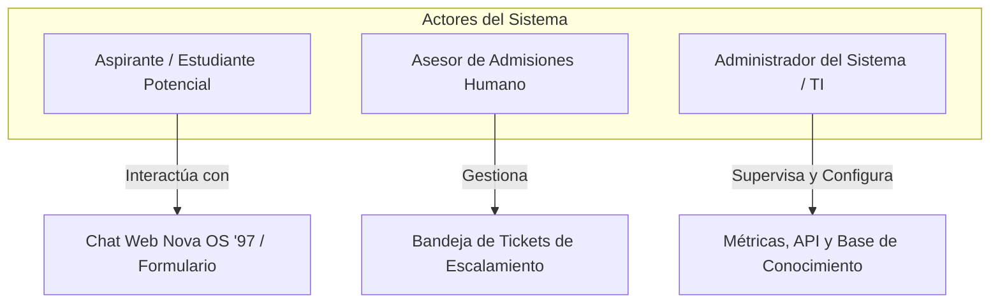

# Documento de Diseño de Software
## Sistema de Asistencia Inteligente de Admisiones: "Nova OS '97"
### Evidencia de Producto 1 — Norma SENA 220501095

- **Programa de Formación:** Análisis y Desarrollo de Software (ADSO)
- **Norma de Competencia:** 220501095 — *Diseñar la solución de software de acuerdo con procedimientos y requisitos técnicos.*
- **Candidato / Aprendiz:** `[Nombre del Aprendiz]`
- **Documento de Identidad:** `[C.C. / T.I. Número]`
- **Organización Beneficiaria:** Nova Idiomas Colombia
- **Fecha de Elaboración:** 2026-09-02 (Zona Horaria: `America/Bogota`)
- **Versión del Documento:** 1.0.0

---

## 1. Introducción del Sistema

El proyecto **"Nova OS '97" (Synapse Admissions AI)** es una solución integral de software diseñada para transformar y automatizar el proceso de orientación, atención al cliente y admisiones de la academia **Nova Idiomas Colombia**.

Nova Idiomas Colombia es una institución educativa de idiomas con sedes físicas de alta demanda en **Bogotá (Chicó y Chapinero)**, **Medellín (Poblado y Laureles)**, **Cali (Granada)** y una división **Virtual Sincrónica** de alcance nacional e internacional. Su catálogo formativo comprende cursos de **Inglés (General, Intensivo y Business)**, **Francés (DELF/DALF)**, **Alemán (Goethe-Zertifikat)**, **Portugués** y **Español para extranjeros**, además de talleres de preparación para certificaciones internacionales como **IELTS, TOEFL iBT y Cambridge B2/C1**.

La solución de software desarrollada combina un frontend web reactivo y ergonómico basado en **Next.js 15**, gráficos acelerados por GPU mediante **PixiJS WebGL** y una estética retro "Windows/Mac '97" dotada de un filtro óptico CRT anti-fatiga visual, con un backend de alto rendimiento en **Python puro (FastAPI)** que opera una arquitectura de recuperación documental aumentada por generación (**RAG Híbrido**), máquinas de estado para navegación determinística por menús y derivación estructurada a consejeros humanos de admisiones.

---

## 2. Descripción del Problema a Resolver

El departamento de admisiones y atención al usuario de Nova Idiomas Colombia enfrenta un conjunto crítico de dificultades operativas:

1. **Saturación en Canales Digitales:** Diariamente se reciben cientos de solicitudes a través de WhatsApp, Telegram, correo electrónico y formularios web solicitando información repetitiva: horarios, costos oficiales en pesos colombianos (COP), fechas de inicio, sedes y exámenes de clasificación.
2. **Tiempos de Espera Prolongados:** Los asesores humanos dedican más del 70% de su jornada laboral a responder preguntas frecuentes básicas (FAQs), generando cuellos de botella que incrementan el tiempo de espera de prospectos con dudas complejas o requerimientos empresariales.
3. **Inconsistencias y Errores de Información:** La dispersión de tarifas, promociones de temporada, descuentos por convenios de cajas de compensación familiar (Compensar, Colsubsidio, Comfama) y franjas horarias provoca respuestas dispares entre diferentes agentes humanos.
4. **Riesgo de Alucinaciones en Respuestas con IA Genérica:** El uso de modelos de lenguaje sin conexión estricta a documentos institucionales conlleva alucinaciones graves, tales como inventar programas inexistentes, ofrecer becas universitarias gratuitas no aprobadas por la junta directiva o cotizar precios en monedas extranjeras.
5. **Pérdida de Trazabilidad:** Las consultas que superan el alcance de la información estándar se pierden con frecuencia entre conversaciones de chat sin registrar un ticket formal de seguimiento.

---

## 3. Objetivos del Sistema

### 3.1 Objetivo General
Diseñar y especificar una solución de software orientada a la atención de admisiones académicas, basada en un motor RAG híbrido, navegación determinística y derivación a consejeros humanos, garantizando respuestas fidedignas en sub-30ms sobre documentos oficiales y cero alucinaciones en tarifas y políticas institucionales.

### 3.2 Objetivos Específicos
1. **Diseñar una arquitectura modular desacoplada (Clean Architecture)** que separe la capa de presentación web, la pasarela API REST, los filtros de seguridad, el motor de recuperación documental y el subsistema de persistencia.
2. **Modelar una máquina de estados finitos de navegación guiada** organizada en 4 pilares temáticos (Cursos, Horarios, Precios y Sedes) y 24 hojas de consulta rápida para reducir la fricción del aspirante.
3. **Definir un pipeline de recuperación híbrida** que combine búsqueda densa en espacios vectoriales (ChromaDB) y búsqueda léxica (BM25 con lematización en español) mediante el algoritmo Reciprocal Rank Fusion (RRF).
4. **Diseñar un protocolo de guardrails de seguridad y escalamiento humano** con detección previa de inyecciones de prompt y generación de tickets estructurados (`ESC-YYYYMMDD-XXXX`).
5. **Establecer un esquema de caché invalidation-aware** de doble capa (exacta SHA-256 y semántica vectorial) para optimizar costos de cómputo y ofrecer latencias instantáneas.

---

## 4. Actores o Usuarios del Sistema



### 4.1 Aspirante / Estudiante Potencial
- **Perfil:** Persona interesada en iniciar estudios de idiomas o certificar sus competencias lingüísticas.
- **Acciones:** Consulta programas, franjas horarias, tarifas y descuentos vigentes; agenda su examen de clasificación gratuito (*Placement Test*); interactúa con el menú guiado o solicita asesoría humana directa.

### 4.2 Asesor de Admisiones Humano (Staff)
- **Perfil:** Funcionario del equipo comercial y académico de Nova Idiomas Colombia.
- **Acciones:** Recibe y gestiona los tickets de escalamiento generados por el sistema (`ESC-YYYYMMDD-XXXX`); consulta el historial y la transcripción del diálogo; contacta al aspirante vía WhatsApp o llamada telefónica para cerrar la matrícula.

### 4.3 Administrador del Sistema / Ingeniero de TI
- **Perfil:** Responsable del soporte tecnológico, infraestructura y calidad de la inteligencia artificial.
- **Acciones:** Carga y actualiza documentos normativos en `data/documents/`; audita las métricas de latencia y costos; supervisa la tasa de aciertos de la caché y el estado de salud de los microservicios.

---

## 5. Requisitos del Software

### 5.1 Requisitos Funcionales (RF)

| Código | Requisito Funcional | Descripción | Prioridad (MoSCoW) |
| :--- | :--- | :--- | :---: |
| **RF-01** | Recepción de consultas web y API | El sistema debe recibir consultas a través de una interfaz gráfica web interactiva y exponer un endpoint REST `POST /api/v1/chat`. | Must Have |
| **RF-02** | Navegación guiada por pilares temáticos | Proveer un menú estructurado con 4 pilares: 1. Cursos, 2. Horarios, 3. Precios y 4. Sedes, operable mediante números o botones clicables. | Must Have |
| **RF-03** | Tolerancia a erratas tipográficas | Identificar intenciones mediante distancia Levenshtein ($\le 2$) ante errores de escritura comunes (ej. `horaroi` $\to$ `horario`). | Should Have |
| **RF-04** | Ingesta y chunking documental | Procesar documentos Markdown institucionales aplicando división por encabezados y solapamiento (*overlap*) de 100 caracteres. | Must Have |
| **RF-05** | Búsqueda léxica BM25 con lematización | Ejecutar búsqueda léxica BM25 en español con normalización Unicode NFD y filtrado de palabras de parada (*stop-words*). | Must Have |
| **RF-06** | Búsqueda densa vectorial | Calcular similitud coseno entre la consulta y los fragmentos vectorizados mediante embeddings de 384 dimensiones en ChromaDB. | Must Have |
| **RF-07** | Fusión de resultados RRF | Integrar rankings denso y léxico mediante el algoritmo Reciprocal Rank Fusion ($k=60$) para seleccionar el Top-4 de fragmentos. | Must Have |
| **RF-08** | Caché de doble capa invalidation-aware | Resolver consultas idénticas mediante hash SHA-256 en $O(1)$ y similitud semántica ($\ge 0.88$), purgándose automáticamente ante cambios documentales. | Must Have |
| **RF-09** | Filtro de seguridad contra inyecciones | Detectar patrones maliciosos (*jailbreaks*, extracción de prompts, "ignore previous instructions") antes de consultar el motor RAG. | Must Have |
| **RF-10** | Manejo de política "Becas como Descuentos" | Responder a consultas sobre becas aclarando que la institución no otorga becas de mérito sino descuentos del 10% y 15% según el documento oficial `12_04`. | Must Have |
| **RF-11** | Escalamiento estructurado a humanos | Si el score de similitud es inferior a $0.35$ (pilar) o $0.50$ (general), ofrecer escalamiento en 2 fases (`¿Deseas escalar a asesor humano? Sí/No`). | Must Have |
| **RF-12** | Generación de tickets de seguimiento | Generar y registrar tickets únicos con formato `ESC-YYYYMMDD-XXXX` persistidos en `data/escalations.json`. | Must Have |
| **RF-13** | Agendamiento de Placement Test | Permitir el registro de solicitudes para el examen de clasificación gratuito con captura de nombre, email, teléfono, sede y fecha. | Should Have |
| **RF-14** | Telemetría y métricas operativas | Registrar y exponer métricas de consultas totales, latencia en milisegundos, tasa de escalamiento y porcentaje de aciertos en caché. | Should Have |

### 5.2 Requisitos No Funcionales (RNF)

| Código | Requisito No Funcional | Métrica / Criterio de Aceptación | Categoría |
| :--- | :--- | :--- | :--- |
| **RNF-01** | Latencia en aciertos de caché | Las respuestas resueltas por la caché exacta deben entregarse en menos de **30 milisegundos**. | Rendimiento |
| **RNF-02** | Latencia de inferencia directa RAG | El tiempo total de procesamiento para respuestas directas del motor RAG no debe exceder **2.5 segundos**. | Rendimiento |
| **RNF-03** | Tasa de fidelidad y cero alucinaciones | El 100% de las respuestas sobre precios, sedes y horarios debe estar respaldado en citas textuales de los documentos oficiales. | Precisión |
| **RNF-04** | Disponibilidad del servicio | La API de FastAPI y la interfaz web deben mantener una disponibilidad mínima de **99.5%**. | Fiabilidad |
| **RNF-05** | Eficiencia de costos de API | Reducción de al menos un **40%** en consumo de tokens de modelos generativos gracias a la caché y navegación determinística. | Eficiencia |
| **RNF-06** | Rendimiento visual en cliente | El fondo WebGL con partículas en PixiJS debe sostener **60 cuadros por segundo (FPS)** estables sin bloquear el hilo de React. | Usabilidad |
| **RNF-07** | Ergonomía visual y accesibilidad | Disponer de un conmutador de filtro óptico CRT anti-fatiga visual y diseño responsivo para dispositivos móviles y escritorio. | Ergonomía |
| **RNF-08** | Seguridad de datos personales | Cumplimiento estricto de la **Ley 1581 de 2012 (Habeas Data)** en la captura de datos de aspirantes para tickets y placement test. | Seguridad / Legal |
| **RNF-09** | Portabilidad y arranque multiplataforma | Capacidad de arranque mediante un solo clic (`start.bat` en Windows y `start.sh` en Linux/macOS) mediante el supervisor `run.py`. | Portabilidad |
| **RNF-10** | Mantenibilidad y desacoplamiento | Cobertura de pruebas unitarias superior al **90%** con suite automatizada en Pytest ejecutándose en menos de 40 segundos. | Mantenibilidad |

---

## 6. Arquitectura del Software

El sistema implementa una arquitectura multicapa desacoplada orientada a microservicios y Clean Architecture:

```text
┌─────────────────────────────────────────────────────────────────────────────┐
│                          1. CAPA DE PRESENTACIÓN (UI)                       │
│  - Next.js 15 (App Router) + TypeScript + Tailwind CSS (Puerto 3000)        │
│  - Fondo interactivo WebGL con partículas aceleradas por GPU (PixiJS)       │
│  - Terminal interactiva "Nova OS '97" con filtro óptico CRT conmutable      │
│  - Renderizado nativo de Markdown GFM con componentes visuales              │
└──────────────────────────────────────┬──────────────────────────────────────┘
                                       │ HTTP / JSON (Proxy /api/v1/*)
                                       ▼
┌─────────────────────────────────────────────────────────────────────────────┐
│                          2. CAPA API GATEWAY & REST                         │
│  - FastAPI Framework Asíncrono en Python Puro (Puerto 8000)                 │
│  - Validación estricta de esquemas I/O con Pydantic v2                      │
│  - Endpoints: POST /api/v1/chat, GET /metrics, GET /health, POST /escalate  │
└──────────────────────────────────────┬──────────────────────────────────────┘
                                       │
                                       ▼
┌─────────────────────────────────────────────────────────────────────────────┐
│                    3. CAPA DE SEGURIDAD & GUARDRAILS                        │
│  - Filtro Pre-Flight contra inyecciones de prompt y jailbreaks (Regex)      │
│  - Validación de longitud (máximo 1000 caracteres) y sanitización Unicode   │
│  - Bloqueo inmediato de solicitudes no autorizadas                          │
└──────────────────────────────────────┬──────────────────────────────────────┘
                                       │
                                       ▼
┌─────────────────────────────────────────────────────────────────────────────┐
│               4. MÁQUINA DE ESTADOS DE NAVEGACIÓN DETERMINÍSTICA            │
│  - GuidedNavigationEngine: 4 pilares temáticos y 24 hojas de consulta       │
│  - Diccionario de más de 85 sinónimos y lematización de intención           │
│  - Corrección de erratas tipográficas por distancia Levenshtein             │
└──────────────────────────────────────┬──────────────────────────────────────┘
                                       │ Consulta no determinística
                                       ▼
┌─────────────────────────────────────────────────────────────────────────────┐
│                      5. CAPA DE CACHÉ DE DOBLE CAPA                         │
│  - Nivel 1: Caché Exacta SHA-256 en memoria (Latencia < 20 ms)              │
│  - Nivel 2: Caché Semántica Coseno (Umbral 0.88 pilares / 0.92 descuentos)  │
│  - Invalidation-Aware: Auto-purga automática ante cambios de hash documental│
└──────────────────────────────────────┬──────────────────────────────────────┘
                                       │ Cache Miss
                                       ▼
┌─────────────────────────────────────────────────────────────────────────────┐
│                  6. MOTOR DE RECUPERACIÓN DOCUMENTAL HÍBRIDO                │
│  - Búsqueda Densa: ChromaDB con embeddings all-MiniLM-L6-v2                 │
│  - Búsqueda Léxica: PureBM25 en Python con lematizador de sufijos en español│
│  - Fusión RRF: Reciprocal Rank Fusion (k=60) + Intent Coverage Boost        │
└──────────────────────────────────────┬──────────────────────────────────────┘
                                       │ Top Chunks Documentales
                                       ▼
┌─────────────────────────────────────────────────────────────────────────────┐
│             7. CAPA DE SÍNTESIS / RAZONAMIENTO Y ESCALAMIENTO               │
│  - Evaluación de confianza vs umbral (0.35 para pilar / 0.50 para general)  │
│  - Rama A: Síntesis fundamentada con LLM / OpenCode Deep Reasoning (:4096)  │
│  - Rama B: Escalamiento humano en 2 fases con ticket ESC-YYYYMMDD-XXXX      │
└─────────────────────────────────────────────────────────────────────────────┘
```

---

## 7. Descripción de Módulos del Sistema

### Módulo 1: Presentación & Experiencia de Usuario (`frontend/`)
Responsable de renderizar la terminal retro en Next.js 15, gestionar el estado del chat en el cliente, despachar peticiones mediante el reverse proxy de `next.config.mjs`, renderizar el lienzo de partículas PixiJS y formatear el texto enriquecido mediante `react-markdown` y `remark-gfm`.

### Módulo 2: Gateway API REST (`backend/src/api/`)
Gestiona el ciclo de vida de las peticiones HTTP, valida los contratos de entrada y salida mediante esquemas Pydantic (`ChatRequest`, `ChatResponse`), expone endpoints de salud (`/health`), telemetría (`/metrics`), chat estándar y streaming en tiempo real (Server-Sent Events).

### Módulo 3: Guardrails de Seguridad (`backend/src/core/guardrails.py`)
Intercepta las cadenas de texto del usuario antes de que consuman recursos computacionales. Evalúa expresiones regulares compiladas contra ataques de inyección de prompt, comandos de evasión de instrucciones y solicitudes de becas ficticias del 100%.

### Módulo 4: Navegación Guiada (`backend/src/core/navigation.py`)
Implementa un árbol de decisión interactivo que procesa selecciones numéricas (`1` a `4`, subcódigos `1.1` a `4.6`) o comandos de retorno (`0`, `menu`), devolviendo respuestas inmediatas en sub-10ms con botones de acción rápida.

### Módulo 5: Caché de Doble Capa (`backend/src/core/cache.py`)
Mantiene dos almacenes en memoria: una tabla hash indexada por el hash criptográfico SHA-256 de la consulta normalizada y una lista de tuplas vectoriales para comparación semántica. Detecta cambios en la carpeta de documentos mediante un hash global para invalidar el estado obsoleto.

### Módulo 6: Recuperador Híbrido RAG (`backend/src/rag/`)
Orquesta la recuperación concurrente de candidatos en ChromaDB (vectores densos) y en el índice BM25 (palabras clave con lematización). Aplica la fórmula de Reciprocal Rank Fusion ($k=60$) y pondera el resultado final según la cobertura léxica de los términos consultados.

### Módulo 7: Despachador de Escalamiento (`backend/src/core/dispatcher.py`)
Genera tickets de soporte formal cuando una consulta supera el alcance de la documentación oficial o cuando el aspirante solicita hablar con un asesor. Asigna identificadores legibles `ESC-YYYYMMDD-XXXX`, persiste el registro en `data/escalations.json` y emite notificaciones por webhook.

---

## 8. Justificación Técnica de la Solución

| Componente | Tecnología Seleccionada | Alternativas Descartadas | Justificación Técnica de la Decisión |
| :--- | :--- | :--- | :--- |
| **Backend Framework** | **FastAPI (Python 3.10+)** | Django, Flask, Express (Node.js) | Soporte nativo para programación asíncrona (`asyncio`), generación automática de contratos OpenAPI/Swagger, validación estricta con Pydantic y tipado nativo. |
| **Motor Vectorial** | **ChromaDB (Embebido local)** | Pinecone, Milvus, Weaviate | Ejecución 100% local sin costos por suscripción mensual en la nube, latencia de red nula (in-process) y compatibilidad directa con Python. |
| **Búsqueda Léxica** | **PureBM25 (Python puro)** | Elasticsearch, Apache Solr | Evita dependencias pesadas de JVM (Java) en la máquina host, consumo de RAM despreciable (<2 MB) y calibración específica para lematización de sufijos en español. |
| **Algoritmo de Fusión** | **Reciprocal Rank Fusion ($k=60$)** | Ponderación lineal de scores | Elimina la disparidad de escala entre similitudes coseno acotadas [0, 1] y valores de frecuencia BM25 ilimitados, evitando sesgos en los candidatos seleccionados. |
| **Frontend Framework** | **Next.js 15 (App Router)** | Single Page Application (Vite + React) | Renderizado optimizado, división automática de código, proxy inverso integrado que elimina problemas de CORS y soporte nativo para Server Components. |
| **Motor Gráfico** | **PixiJS (WebGL 2D Canvas)** | Partículas CSS / DOM de React | Delegación de renderizado directamente a la GPU a 60 FPS estables sin saturar el árbol de reconciliación de React con cientos de nodos DOM. |
| **Supervisor de Procesos**| **`run.py` (Python multi-proceso)** | Docker Compose obligatorio | Permite arranque inmediato en Windows y Linux sin exigir privilegios de administrador ni virtualización Docker activa en la máquina del usuario evaluador. |
