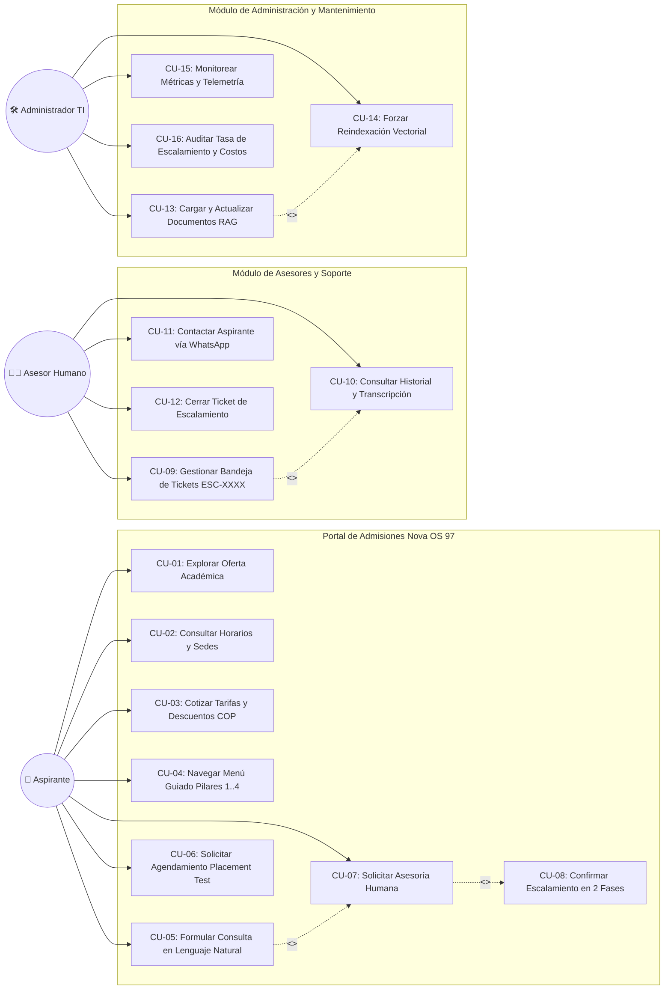
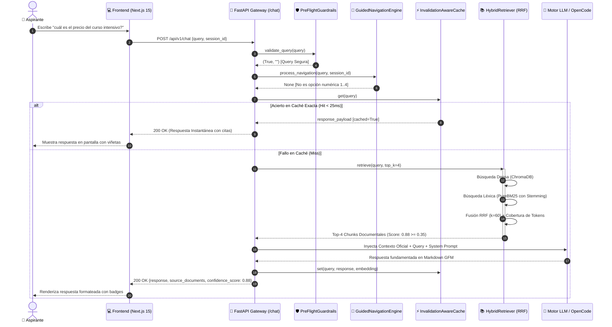
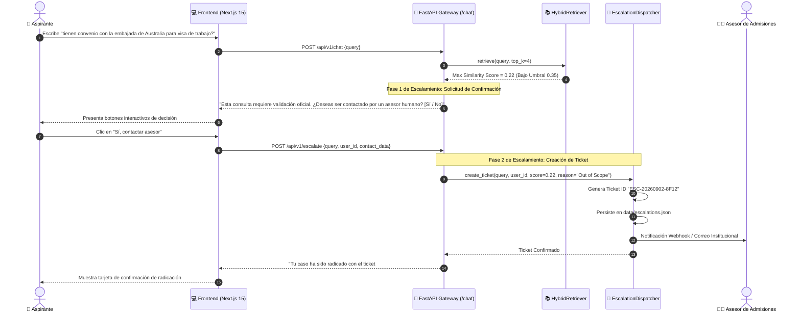
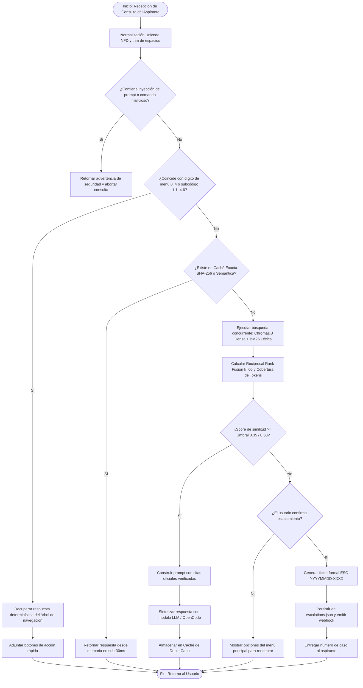

# Diagramas de Lenguaje Unificado de Modelado (UML)
## Sistema de Asistencia Inteligente de Admisiones: "Nova OS '97"
### Evidencia de Producto 2 — Norma SENA 220501095

- **Programa de Formación:** Análisis y Desarrollo de Software (ADSO)
- **Norma de Competencia:** 220501095 — *Diseñar la solución de software de acuerdo con procedimientos y requisitos técnicos.*
- **Candidato / Aprendiz:** `[Nombre del Aprendiz]`
- **Documento de Identidad:** `[C.C. / T.I. Número]`
- **Organización Beneficiaria:** Nova Idiomas Colombia
- **Fecha de Elaboración:** 2026-09-02 (Zona Horaria: `America/Bogota`)
- **Herramientas de Modelado:** Mermaid.js, compatible con Draw.io, Lucidchart y StarUML.

---

## 1. Diagrama de Casos de Uso del Sistema

Este diagrama modela las interacciones entre los tres actores principales (**Aspirante**, **Asesor de Admisiones** y **Administrador de TI**) y las funcionalidades provistas por el sistema de software.

### Descripción de los Casos de Uso Principales:
- **CU-04 (Navegar Menú Guiado):** Permite al aspirante explorar los 4 pilares institucionales (Cursos, Horarios, Precios y Sedes) mediante selecciones directas numéricas (`1` al `4`) o botones de interfaz sin consumo de tokens de IA.
- **CU-05 (Formular Consulta en Lenguaje Natural):** Recibe preguntas abiertas del aspirante, las filtra mediante guardrails de seguridad y las resuelve a través del recuperador híbrido RAG.
- **CU-08 (Confirmar Escalamiento en 2 Fases):** Cuando una consulta cae por debajo del umbral de confianza o supera el alcance oficial, el sistema muestra el mejor fragmento disponible y solicita confirmación explícita (`¿Deseas escalar a asesor humano? Sí/No`) antes de crear el ticket.
- **CU-09 (Gestionar Bandeja de Tickets):** Permite al equipo humano revisar los casos radicados bajo identificadores estructurados `ESC-YYYYMMDD-XXXX`.

---

## 2. Diagrama de Clases del Dominio y Servicios

El diagrama de clases modela la arquitectura estática del backend en Python, mostrando las clases de datos Pydantic, los servicios del núcleo de seguridad y navegación, y los componentes del subsistema RAG híbrido.

```mermaid
classDiagram
    class ChatRequest {
        +str query
        +str user_id
        +str session_id
        +bool use_opencode_mode
    }

    class ChatResponse {
        +str status
        +str response
        +List~str~ source_documents
        +float confidence_score
        +bool escalated_to_human
        +bool cached
        +str mode
        +float latency_ms
        +List~ActionButton~ action_buttons
    }

    class ActionButton {
        +str label
        +str value
    }

    class PreFlightGuardrails {
        -List~str~ INJECTION_PATTERNS
        +validate_query(query: str) Tuple~bool, str~
        +evaluate_relevance(similarity_score: float, threshold: float) bool
    }

    class GuidedNavigationEngine {
        +str ROOT_MENU
        +Dict~str, str~ INTENT_SYNONYMS
        +Dict~str, str~ LEAF_QUERY_MAP
        +process_navigation(input_text: str, session_id: str) Dict
        -_levenshtein(s1: str, s2: str) int
        -_normalize(text: str) str
    }

    class InvalidationAwareQueryCache {
        -Dict exact_cache
        -List semantic_cache
        -str last_docs_hash
        -int ttl_seconds
        +get(query: str) Dict
        +set(query: str, response: Dict, embedding: List) None
        +check_and_invalidate() bool
    }

    class HybridRetriever {
        -int rrf_k
        -PureBM25 bm25_index
        -VectorStore vector_store
        +retrieve(query: str, top_k: int, candidate_k: int) List~ChunkResult~
        -_ensure_bm25_populated() None
        -_calculate_rrf_score(dense_rank: int, bm25_rank: int) float
    }

    class PureBM25 {
        -float k1
        -float b
        -Dict inverted_index
        -List doc_lengths
        -float avg_doc_len
        +fit(corpus: List~str~) None
        +search(query: str, top_k: int) List~Tuple~
        -_stem(word: str) str
        -_idf(term: str) float
    }

    class VectorStore {
        -str collection_name
        -str persist_directory
        +query(query: str, top_k: int) List~Dict~
        +get_all_documents() List~Dict~
        +embed_query(query: str) List~float~
    }

    class EscalationDispatcher {
        -str storage_file
        +create_ticket(query: str, user_id: str, confidence_score: float, reason: str) Dict
        +dispatch_webhook(ticket: Dict) bool
        -_persist(ticket: Dict) None
    }

    class TicketRecord {
        +str ticket_id
        +str query
        +str user_id
        +float confidence_score
        +str reason
        +str status
        +str created_at
    }

    %% Relaciones
    ChatResponse *-- ActionButton
    HybridRetriever o-- PureBM25
    HybridRetriever o-- VectorStore
    EscalationDispatcher ..> TicketRecord : crea y persiste
```

---

## 3. Diagramas de Secuencia

### 3.1 Diagrama de Secuencia 1: Flujo Exitoso de Consulta RAG con Caché Híbrida

Modela el ciclo de vida completo desde que el aspirante ingresa una pregunta en la terminal web hasta que recibe la respuesta fundamentada con citas institucionales.

---

### 3.2 Diagrama de Secuencia 2: Protocolo de Escalamiento Humano en Dos Fases

Modela el comportamiento cuando la pregunta no puede responderse con la documentación oficial o cae por debajo del umbral de corte ($<0.35$).

---

## 4. Diagrama de Actividades / Flujo del Sistema

Modela el algoritmo de toma de decisiones implementado en el backend para clasificar y procesar cualquier interacción entrante.

