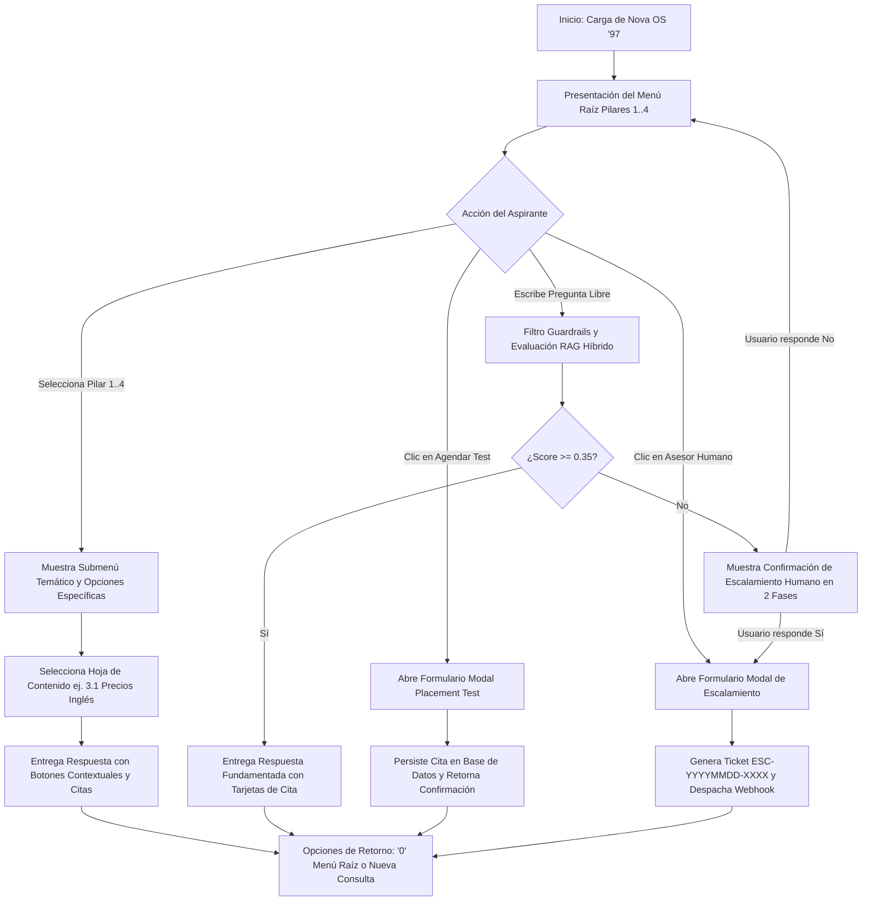

# Prototipo de Solución de Software
## Sistema de Asistencia Inteligente de Admisiones: "Nova OS '97"
### Evidencia de Producto 3 — Norma SENA 220501095

- **Programa de Formación:** Análisis y Desarrollo de Software (ADSO)
- **Norma de Competencia:** 220501095 — *Diseñar la solución de software de acuerdo con procedimientos y requisitos técnicos.*
- **Candidato / Aprendiz:** `[Nombre del Aprendiz]`
- **Documento de Identidad:** `[C.C. / T.I. Número]`
- **Organización Beneficiaria:** Nova Idiomas Colombia
- **Fecha de Elaboración:** 2026-09-02 (Zona Horaria: `America/Bogota`)
- **Enfoque de Diseño:** Retro-Futurista Macintosh/Windows '97 con ergonomía visual contemporánea (Next.js 15 + PixiJS).

---

## 1. Fundamentos de Diseño y Experiencia de Usuario (UX/UI)

El diseño de la interfaz de usuario de **Nova OS '97** se basa en la combinación de elementos visuales retro de finales de los años 90 con componentes de accesibilidad y ergonomía modernos:

1. **Paleta de Colores Ergonométrica:**
   - **Fondo Base (Obsidiana):** `#0a0b10` y `#0d0f18` para minimizar el cansancio ocular en sesiones prolongadas.
   - **Acentos Retro Neón:** Turquesa Neón (`#00f0ff`), Fucsia Neón (`#ff007f`) y Ámbar de Alerta (`#ffb700`).
   - **Tipografía de Alta Legibilidad:** Fuentes monoespaciadas para terminal (`JetBrains Mono`, `Courier New`) combinadas con fuentes sans-serif humanistas para textos de lectura continua.
2. **Filtro Óptico CRT Anti-Fatiga:**
   - Simulación visual de líneas de barrido (*scanlines*), curvatura sutil y brillo fosforescente.
   - Incluye un conmutador rápido `[CRT: ON / OFF]` en la barra superior para que usuarios sensibles a los efectos retro puedan desactivarlo con un solo clic.
3. **Microinteracciones y Feedback Inmediato:**
   - Indicadores de estado de servidor en vivo (FastAPI :8000, OpenCode :4096, Next.js :3000).
   - Botones de acción rápida que ahorran digitación en dispositivos móviles y de escritorio.

---

## 2. Wireframes y Mockups de Pantallas Principales

### 2.1 Pantalla Principal: Terminal Interactiva "Nova OS '97"

Es la interfaz pública principal con la que interactúa el aspirante al ingresar al portal de admisiones:

```text
┌────────────────────────────────────────────────────────────────────────────────────────┐
│ 🌴 NOVA IDIOMAS COLOMBIA — ADMISSIONS OS '97 (v2.6.0)                   [—] [口] [X]  │
├────────────────────────────────────────────────────────────────────────────────────────┤
│ [ARCHIVO]  [EDITAR]  [OFERTA 2026]  [MÉTRICAS]  [AYUDA]       🕒 10:45 AM | BOGOTÁ     │
├────────────────────────────────────────────────────────────────────────────────────────┤
│ 📢 BIENVENIDO A NOVA IDIOMAS • SEDES BOGOTÁ, MEDELLÍN, CALI & VIRTUAL • MATRÍCULAS 2026 │
├────────────────────────────────────────────────────────────────────────────────────────┤
│                                                                                        │
│  🏛️ [SISTEMA] 10:45:02                                                                 │
│  ┌──────────────────────────────────────────────────────────────────────────────────┐  │
│  │ ¡Bienvenido al Portal Oficial de Admisiones de Nova Idiomas Colombia!             │  │
│  │ Selecciona un pilar temático escribiendo el número o haciendo clic:              │  │
│  │                                                                                  │  │
│  │  1️⃣ [Cursos & Idiomas]     : Inglés, Francés, Alemán, Portugués (MCER A1-C2)    │  │
│  │  2️⃣ [Horarios & Franjas]    : Madrugadores, Diurnos, Nocturnos y Sabatinos       │  │
│  │  3️⃣ [Precios & Descuentos]  : Tarifas oficiales COP, 10% Contado, 15% Cajas     │  │
│  │  4️⃣ [Sedes & Contacto]      : Chicó, Chapinero, Poblado, Laureles, Cali, Virtual │  │
│  │                                                                                  │  │
│  │ También puedes formular tu pregunta en lenguaje natural en cualquier momento.    │  │
│  └──────────────────────────────────────────────────────────────────────────────────┘  │
│                                                                                        │
│  👤 [ASPIRANTE] 10:45:30                                                               │
│  "¿Cuáles son los precios del curso intensivo de inglés y qué descuentos aplican?"      │
│                                                                                        │
│  🤖 [ASISTENTE RAG] 10:45:31 • Latencia: 22ms • [Hit Caché Semántica 0.94]            │
│  ┌──────────────────────────────────────────────────────────────────────────────────┐  │
│  │ ### 📚 Programa de Inglés Intensivo (10 horas/semana)                            │  │
│  │ • Tarifa Plena Oficial: **$650.000 COP** mensuales.                              │  │
│  │                                                                                  │  │
│  │ ### 🏷️ Descuentos Institucionales Vigentes (Doc 12_04):                         │  │
│  │ • **10% de Descuento:** Pago de contado por ciclo ($585.000 COP netos).         │  │
│  │ • **15% por Caja de Compensación:** Compensar, Colsubsidio y Comfama.           │  │
│  │ • **Financiación:** 3 cuotas sin interés mediante PSE, Nequi o Bancolombia.      │  │
│  │                                                                                  │  │
│  │ 📌 *Documentos fuente: `03_precios_ingles.md`, `12_04_becas_descuentos.md`*       │  │
│  └──────────────────────────────────────────────────────────────────────────────────┘  │
│                                                                                        │
├────────────────────────────────────────────────────────────────────────────────────────┤
│ [1. Cursos]  [2. Horarios]  [3. Precios]  [4. Sedes]  [🎯 Agendar Test]  [👨‍💼 Asesor]  │
├────────────────────────────────────────────────────────────────────────────────────────┤
│ > [ Escribe tu consulta aquí...                                        ] [ENVIAR] [🎤] │
├────────────────────────────────────────────────────────────────────────────────────────┤
│ Estado: Conectado (FastAPI :8000 | OpenCode :4096)               [CRT SCANLINES: ON]   │
└────────────────────────────────────────────────────────────────────────────────────────┘
```

---

### 2.2 Gestión de Oferta Académica y Catálogo de Cursos

Módulo visual donde el aspirante o el personal administrativo puede contrastar idiomas, niveles del Marco Común Europeo de Referencia (MCER), franjas horarias y costos en tiempo real:

```text
┌────────────────────────────────────────────────────────────────────────────────────────┐
│ 📚 CATÁLOGO Y EXPLORADOR ACADÉMICO — NOVA IDIOMAS COLOMBIA              [—] [口] [X]  │
├────────────────────────────────────────────────────────────────────────────────────────┤
│ Filtros: [ Todos los Idiomas ▼ ]  [ Todas las Sedes ▼ ]  [ Modalidad: Presencial/Virtual ]│
├────────────────────────────────────────────────────────────────────────────────────────┤
│                                                                                        │
│  ┌─────────────────────────┐ ┌─────────────────────────┐ ┌─────────────────────────┐  │
│  │ 🇬🇧 INGLÉS GENERAL/INT.  │ │ 🇫🇷 FRANCÉS DELF/DALF    │ │ 🇩🇪 ALEMÁN GOETHE        │  │
│  ├─────────────────────────┤ ├─────────────────────────┤ ├─────────────────────────┤  │
│  │ • Niveles: A1 hasta C1  │ │ • Niveles: A1 hasta B2  │ │ • Niveles: A1 hasta B2  │  │
│  │ • Duración: 4-8 meses   │ │ • Enfoque Comunicativo  │ │ • Preparación Oficial   │  │
│  │ • Franja: Madrugador/Noc│ │ • Franja: Diurna/Noche  │ │ • Franja: Sabatina      │  │
│  │ • Valor: $585.000 COP   │ │ • Valor: $620.000 COP   │ │ • Valor: $640.000 COP   │  │
│  │                         │ │                         │ │                         │  │
│  │ [Ver Malla Curricular]  │ │ [Ver Malla Curricular]  │ │ [Ver Malla Curricular]  │  │
│  │ [Cotizar con Descuento] │ │ [Cotizar con Descuento] │ │ [Cotizar con Descuento] │  │
│  └─────────────────────────┘ └─────────────────────────┘ └─────────────────────────┘  │
│                                                                                        │
│  ┌──────────────────────────────────────────────────────────────────────────────────┐  │
│  │ 🧮 SIMULADOR DE MATRÍCULA Y DESCUENTOS EN PESOS COLOMBIANOS (COP)                │  │
│  │ Programa Seleccionado: Inglés Intensivo ($650.000 COP)                           │  │
│  │ Beneficio Aplicable: [ 15% Convenio Caja de Compensación (Compensar) ▼ ]        │  │
│  │ Descuento Calculado: -$97.500 COP                                                │  │
│  │ Total Neto a Cancelar: **$552.500 COP** (Opción 3 cuotas de $184.166 COP)        │  │
│  │                                                                                  │  │
│  │ [Descargar Cotización Formal PDF]               [Proceder a Agendar Nivelación]  │  │
│  └──────────────────────────────────────────────────────────────────────────────────┘  │
└────────────────────────────────────────────────────────────────────────────────────────┘
```

---

### 2.3 Gestión de Tareas / Tickets de Escalamiento Humano (Bandeja del Asesor)

Módulo interno utilizado por el equipo de asesores de admisiones para atender las dudas complejas radicadas por el bot:

```text
┌────────────────────────────────────────────────────────────────────────────────────────┐
│ 👨‍💼 BANDEJA DE TICKETS DE ADMISIONES — ESCALAMIENTOS ACTIVOS             [—] [口] [X]  │
├────────────────────────────────────────────────────────────────────────────────────────┤
│ Filtros: [ Estado: Todos ▼ ]  [ Prioridad: Alta ▼ ]  [ Sede: Todas ▼ ]  🔍 [Buscar ID] │
├────────────────────────────────────────────────────────────────────────────────────────┤
│ TICKET ID         ASPIRANTE         MOTIVO DE ESCALAMIENTO    SCORE RAG  ESTADO       │
├────────────────────────────────────────────────────────────────────────────────────────┤
│ ESC-20260902-8F12 Carlos Mendoza    Convenio Visa Australia   0.22 (Bajo) [PENDIENTE]  │
│ ESC-20260902-3C44 Laura Quintero    Convalidación DELF B2     0.31 (Bajo) [EN GESTIÓN] │
│ ESC-20260902-1A09 Andrés Gómez      Facturación Electrónica   0.28 (Bajo) [RESUELTO]   │
├────────────────────────────────────────────────────────────────────────────────────────┤
│ DETALLE DEL TICKET SELECCIONADO: [ ESC-20260902-8F12 ]                                │
│                                                                                        │
│ • Aspirante: Carlos Mendoza                     • Teléfono / WhatsApp: +57 312 456 7890│
│ • Correo: cmendoza@gmail.com                    • Fecha de Radicación: 02/09/2026 10:48│
│ • Consulta Exacta: "Tienen convenio con embajada de Australia para visa de trabajo?"   │
│                                                                                        │
│ 💬 Transcripción de la Conversación Previa con la IA:                                  │
│   [10:47:10] User: Hola, quiero información para certificar inglés para emigrar.      │
│   [10:47:12] Bot: Ofrecemos preparación para IELTS General Training y Cambridge.      │
│   [10:47:35] User: Tienen convenio con embajada de Australia para visa de trabajo?    │
│   [10:47:36] Bot: [Alerta de Relevancia 0.22 - Escalamiento confirmado por usuario].  │
│                                                                                        │
│ Acciones Rápidas:                                                                      │
│ [📲 Abrir Chat de WhatsApp]  [📧 Enviar Correo Institucional]  [✅ Marcar como Resuelto]│
└────────────────────────────────────────────────────────────────────────────────────────┘
```

---

### 2.4 Formularios de Creación y Edición

#### Formulario A: Agendamiento de Placement Test Gratuito (Examen Diagnóstico)
Permite al aspirante reservar su prueba de nivelación académica sin costo:

```text
┌────────────────────────────────────────────────────────────────────────────────┐
│ 🎯 AGENDAMIENTO DE EXAMEN DE CLASIFICACIÓN (PLACEMENT TEST)       [—] [口] [X] │
├────────────────────────────────────────────────────────────────────────────────┤
│ Complete los siguientes datos para agendar su prueba de nivelación 100% gratis:│
│                                                                                │
│ 1. Nombre Completo:       [ Juan Pablo Restrepo                      ]         │
│ 2. Correo Electrónico:    [ jprestrepo@correo.com                    ]         │
│ 3. Teléfono / WhatsApp:   [ +57 300 987 6543                         ]         │
│ 4. Idioma a Evaluar:      (•) Inglés    ( ) Francés    ( ) Alemán              │
│ 5. Sede o Modalidad:      [ Sede Medellín - El Poblado             ▼ ]         │
│ 6. Nivel Autopercibido:   [ Básico / Principiante (A1 - A2)        ▼ ]         │
│ 7. Fecha y Franja:        [ 2026-09-08 | 10:00 AM - 11:00 AM       ▼ ]         │
│                                                                                │
│ [X] Acepto la Política de Tratamiento de Datos Personales (Ley 1581 de 2012).  │
│                                                                                │
│                   [ CONFIRMAR Y AGENDAR CITA ]       [ CANCELAR ]              │
└────────────────────────────────────────────────────────────────────────────────┘
```

#### Formulario B: Radicación de Ticket de Escalamiento Humano
Desplegado cuando el usuario solicita hablar con un asesor o el sistema detecta un caso especial:

```text
┌────────────────────────────────────────────────────────────────────────────────┐
│ 🎫 RADICACIÓN DE CONSULTA DIRECTA CON ASESOR HUMANO               [—] [口] [X] │
├────────────────────────────────────────────────────────────────────────────────┤
│ Tu consulta requiere atención especializada de nuestro equipo de admisiones.   │
│                                                                                │
│ 1. Número de Contacto:    [ +57 310 123 4567                         ]         │
│ 2. Canal Preferido:       (•) WhatsApp Inmediato     ( ) Llamada Telefónica    │
│ 3. Asunto / Categoría:    [ Convenios Corporativos y Descuentos    ▼ ]         │
│ 4. Mensaje Adicional:     [ Deseo información para afiliar a 15 empleados      │
│                           │ de mi empresa con descuento por nómina.            │
│                           └──────────────────────────────────────────]         │
│                                                                                │
│                   [ GENERAR TICKET DE ATENCIÓN ]       [ VOLVER AL CHAT ]      │
└────────────────────────────────────────────────────────────────────────────────┘
```

#### Formulario C: Carga y Administración de Documentos RAG (Vista de Administrador)
Permite subir nuevos reglamentos y resoluciones de precios para re-indexación automática:

```text
┌────────────────────────────────────────────────────────────────────────────────┐
│ 📁 CARGA DE DOCUMENTOS NORMATIVOS — BASE DE CONOCIMIENTO RAG     [—] [口] [X]  │
├────────────────────────────────────────────────────────────────────────────────┤
│ 1. Título del Documento:  [ Tarifas y Promociones Segundo Semestre 2026      ] │
│ 2. Categoría / Cluster:   [ 03 - Precios y Financiación                    ▼ ] │
│ 3. Archivo Markdown:      [ C:\Docs\tarifas_2026_02.md           ] [EXAMINAR]  │
│ 4. Estrategia Chunking:   (•) Encabezados (500/100 overlap)  ( ) Tabla rígida  │
│                                                                                │
│ [X] Forzar purga de caché semántica al finalizar indexación.                   │
│                                                                                │
│                   [ PROCESAR E INDEXAR EN CHROMADB ]       [ CANCELAR ]        │
└────────────────────────────────────────────────────────────────────────────────┘
```

---

## 3. Mapa de Navegación del Usuario (User Flow)



---

## 4. Principios de Experiencia de Usuario (UX) Implementados

- **Cero Fricción en Primer Contacto:** El aspirante no se enfrenta a una pantalla vacía; el menú de bienvenida con los 4 pilares ofrece orientación inmediata desde el segundo cero.
- **Transparencia en las Fuentes:** Cada respuesta sobre aranceles y normatividad incluye las citas exactas de los documentos institucionales consultados, brindando seguridad jurídica y comercial.
- **Tiempos Perceptivos Inmediatos:** Respuestas resueltas por la memoria caché en menos de 30 milisegundos con transiciones suaves gestionadas por CSS y Framer Motion.
- **Respeto a la Privacidad:** Consentimiento explícito de Habeas Data antes de capturar números de teléfono o correos electrónicos en los formularios modales.
