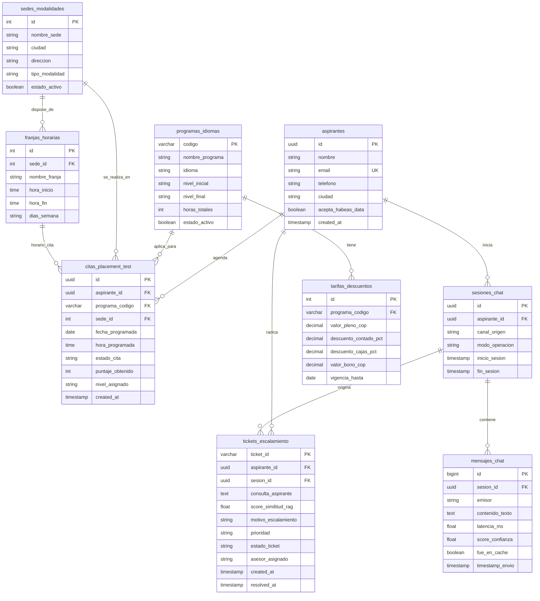

# Modelo de Base de Datos
## Sistema de Asistencia Inteligente de Admisiones: "Nova OS '97"
### Evidencia de Producto 4 — Norma SENA 220501095

- **Programa de Formación:** Análisis y Desarrollo de Software (ADSO)
- **Norma de Competencia:** 220501095 — *Diseñar la solución de software de acuerdo con procedimientos y requisitos técnicos.*
- **Candidato / Aprendiz:** `[Nombre del Aprendiz]`
- **Documento de Identidad:** `[C.C. / T.I. Número]`
- **Organización Beneficiaria:** Nova Idiomas Colombia
- **Fecha de Elaboración:** 2026-09-02 (Zona Horaria: `America/Bogota`)
- **Motor Relacional de Referencia:** PostgreSQL 15+ / ANSI SQL estándar (con soporte JSONB e índices B-Tree).

---

## 1. Identificación de Entidades y Modelo Conceptual

Para asegurar la persistencia transaccional, trazabilidad conversacional, gestión de admisiones y escalamientos del sistema **Nova OS '97**, se identificaron las siguientes entidades clave normalizadas en Tercera Forma Normal (3FN):

1. **`aspirantes`:** Almacena la información de contacto y perfil de los usuarios que interactúan con el portal.
2. **`programas_idiomas`:** Catálogo oficial de cursos de idiomas ofrecidos (Inglés, Francés, Alemán, Portugués).
3. **`sedes_modalidades`:** Campus físicos (Bogotá Chicó/Chapinero, Medellín Poblado/Laureles, Cali Granada) y sede virtual.
4. **`franjas_horarias`:** Horarios institucionales (Madrugadores 6-8 AM, Diurnos, Nocturnos 6:30-8:30 PM, Sabatinos).
5. **`tarifas_descuentos`:** Precios oficiales en COP, porcentajes de descuento por pronto pago (10%) y convenios con cajas de compensación (15%).
6. **`citas_placement_test`:** Solicitudes y agendamientos de exámenes diagnósticos de clasificación gratuitos.
7. **`tickets_escalamiento`:** Casos derivados al equipo humano de admisiones bajo el formato `ESC-YYYYMMDD-XXXX`.
8. **`sesiones_chat` & `mensajes_chat`:** Registro de auditoría y trazabilidad conversacional con métricas de latencia y confianza.
9. **`chunks_conocimiento`:** Metadatos de los 83 documentos oficiales indexados en el motor RAG.

---

## 2. Diagrama Entidad-Relación (ERD en Mermaid)



---

## 3. Diccionario de Datos

### 3.1 Tabla: `aspirantes`
| Campo | Tipo SQL | Nulo | Restricciones | Descripción |
| :--- | :--- | :---: | :--- | :--- |
| `id` | `UUID` | No | `PRIMARY KEY, DEFAULT gen_random_uuid()` | Identificador único universal del aspirante. |
| `nombre` | `VARCHAR(120)` | No | | Nombre y apellidos del aspirante. |
| `email` | `VARCHAR(150)` | No | `UNIQUE` | Correo electrónico institucional o personal. |
| `telefono` | `VARCHAR(20)` | No | | Número de celular / WhatsApp de contacto. |
| `ciudad` | `VARCHAR(60)` | Sí | | Ciudad de residencia (Bogotá, Medellín, Cali, etc.). |
| `acepta_habeas_data`| `BOOLEAN` | No | `DEFAULT TRUE` | Consentimiento legal de tratamiento de datos personales. |
| `created_at` | `TIMESTAMPTZ` | No | `DEFAULT NOW()` | Fecha y hora de creación del registro. |

---

### 3.2 Tabla: `programas_idiomas`
| Campo | Tipo SQL | Nulo | Restricciones | Descripción |
| :--- | :--- | :---: | :--- | :--- |
| `codigo` | `VARCHAR(20)` | No | `PRIMARY KEY` | Código único de la oferta (ej. `ENG-INT-01`, `FR-DELF-B2`). |
| `nombre_programa` | `VARCHAR(100)` | No | | Nombre descriptivo del programa académico. |
| `idioma` | `VARCHAR(30)` | No | | Idioma ofertado (Inglés, Francés, Alemán, Portugués). |
| `nivel_inicial` | `VARCHAR(5)` | No | `CHECK (A1, A2, B1, B2, C1)` | Nivel MCER de ingreso. |
| `nivel_final` | `VARCHAR(5)` | No | `CHECK (A2, B1, B2, C1, C2)` | Nivel MCER meta del programa. |
| `horas_totales` | `INTEGER` | No | `CHECK (horas_totales > 0)` | Intensidad horaria total del ciclo. |
| `estado_activo` | `BOOLEAN` | No | `DEFAULT TRUE` | Indica si el programa está abierto a matrículas. |

---

### 3.3 Tabla: `sedes_modalidades`
| Campo | Tipo SQL | Nulo | Restricciones | Descripción |
| :--- | :--- | :---: | :--- | :--- |
| `id` | `SERIAL` | No | `PRIMARY KEY` | Identificador secuencial de la sede. |
| `nombre_sede` | `VARCHAR(80)` | No | | Nombre oficial (ej. `Bogotá - Chicó`, `Medellín - Laureles`). |
| `ciudad` | `VARCHAR(60)` | No | | Ciudad donde opera la sede física. |
| `direccion` | `VARCHAR(200)` | Sí | | Dirección física oficial de la academia. |
| `tipo_modalidad`| `VARCHAR(20)` | No | `CHECK (Presencial, Virtual, Hibrida)` | Tipo de modalidad ofrecida. |
| `estado_activo` | `BOOLEAN` | No | `DEFAULT TRUE` | Estado operativo de la sede. |

---

### 3.4 Tabla: `tarifas_descuentos`
| Campo | Tipo SQL | Nulo | Restricciones | Descripción |
| :--- | :--- | :---: | :--- | :--- |
| `id` | `SERIAL` | No | `PRIMARY KEY` | Identificador de la tarifa. |
| `programa_codigo` | `VARCHAR(20)` | No | `REFERENCES programas_idiomas(codigo)` | Clave foránea al programa de idiomas. |
| `valor_pleno_cop` | `NUMERIC(12,2)`| No | `CHECK (valor_pleno_cop > 0)` | Precio de lista oficial en Pesos Colombianos. |
| `descuento_contado_pct`| `NUMERIC(5,2)` | No | `DEFAULT 10.00` | Porcentaje de descuento por pago único (10%). |
| `descuento_cajas_pct`| `NUMERIC(5,2)` | No | `DEFAULT 15.00` | Descuento por convenios de cajas de compensación (15%).|
| `valor_bono_cop` | `NUMERIC(12,2)`| No | `DEFAULT 100000.00` | Bono promocional institucional ($100.000 COP). |
| `vigencia_hasta` | `DATE` | No | | Fecha límite de vigencia de la tarifa. |

---

### 3.5 Tabla: `citas_placement_test`
| Campo | Tipo SQL | Nulo | Restricciones | Descripción |
| :--- | :--- | :---: | :--- | :--- |
| `id` | `UUID` | No | `PRIMARY KEY, DEFAULT gen_random_uuid()` | Identificador universal de la cita diagnóstica. |
| `aspirante_id` | `UUID` | No | `REFERENCES aspirantes(id)` | Aspirante que agendó la prueba. |
| `programa_codigo` | `VARCHAR(20)` | No | `REFERENCES programas_idiomas(codigo)` | Idioma que desea certificar o nivelar. |
| `sede_id` | `INTEGER` | No | `REFERENCES sedes_modalidades(id)` | Sede física o modalidad virtual seleccionada. |
| `fecha_programada`| `DATE` | No | | Fecha agendada para la prueba. |
| `hora_programada` | `TIME` | No | | Franja horaria de la cita. |
| `estado_cita` | `VARCHAR(20)` | No | `DEFAULT 'Agendada'` | Estado (`Agendada`, `Presentada`, `Cancelada`). |
| `puntaje_obtenido`| `INTEGER` | Sí | `CHECK (puntaje_obtenido BETWEEN 0 AND 100)` | Resultado numérico obtenido en la evaluación. |
| `nivel_asignado` | `VARCHAR(5)` | Sí | | Nivel clasificado según MCER (A1, A2, B1, B2, C1). |
| `created_at` | `TIMESTAMPTZ` | No | `DEFAULT NOW()` | Fecha y hora de radicación de la cita. |

---

### 3.6 Tabla: `tickets_escalamiento`
| Campo | Tipo SQL | Nulo | Restricciones | Descripción |
| :--- | :--- | :---: | :--- | :--- |
| `ticket_id` | `VARCHAR(30)` | No | `PRIMARY KEY` | Código único legible (ej. `ESC-20260902-8F12`). |
| `aspirante_id` | `UUID` | Sí | `REFERENCES aspirantes(id)` | Aspirante titular del caso (si está autenticado). |
| `sesion_id` | `UUID` | Sí | `REFERENCES sesiones_chat(id)` | Sesión de chat en la que se originó el escalamiento. |
| `consulta_aspirante`| `TEXT` | No | | Pregunta textual que no pudo resolverse por RAG. |
| `score_similitud_rag`| `NUMERIC(4,3)`| No | | Score de confianza arrojado por el híbrido RRF. |
| `motivo_escalamiento`| `VARCHAR(100)`| No | | Causa (`Out of Scope`, `Bajo Umbral`, `Solicitud Humano`).|
| `prioridad` | `VARCHAR(15)` | No | `DEFAULT 'Media'` | Prioridad (`Baja`, `Media`, `Alta`, `Urgente`). |
| `estado_ticket` | `VARCHAR(20)` | No | `DEFAULT 'Pendiente'` | Estado (`Pendiente`, `En Gestion`, `Resuelto`). |
| `asesor_asignado` | `VARCHAR(100)`| Sí | | Nombre del funcionario encargado de contactar al cliente.|
| `created_at` | `TIMESTAMPTZ` | No | `DEFAULT NOW()` | Fecha y hora de apertura del ticket. |
| `resolved_at` | `TIMESTAMPTZ` | Sí | | Fecha y hora en la que se cerró la gestión. |

---

### 3.7 Tablas: `sesiones_chat` y `mensajes_chat`
Registran la interacción conversacional para observabilidad y cálculo de métricas de telemetría:
- **`sesiones_chat`:** `id (UUID PK)`, `aspirante_id (FK)`, `canal_origen (VARCHAR, Web/Telegram)`, `modo_operacion (VARCHAR, direct_rag/opencode_advisor)`, `inicio_sesion`, `fin_sesion`.
- **`mensajes_chat`:** `id (BIGSERIAL PK)`, `sesion_id (FK)`, `emisor (user/bot/system)`, `contenido_texto (TEXT)`, `latencia_ms (FLOAT)`, `score_confianza (FLOAT)`, `fue_en_cache (BOOLEAN)`, `timestamp_envio`.

---

## 4. Script DDL SQL Estándar (PostgreSQL)

```sql
-- Script DDL de Creacion de Esquema Relacional
-- Sistema: Nova Idiomas Admissions OS '97
-- Fecha: 2026-09-02 (America/Bogota)

-- Extension para generacion de UUIDs
CREATE EXTENSION IF NOT EXISTS "pgcrypto";

-- 1. Tabla de Aspirantes
CREATE TABLE IF NOT EXISTS aspirantes (
    id UUID PRIMARY KEY DEFAULT gen_random_uuid(),
    nombre VARCHAR(120) NOT NULL,
    email VARCHAR(150) NOT NULL UNIQUE,
    telefono VARCHAR(20) NOT NULL,
    ciudad VARCHAR(60),
    acepta_habeas_data BOOLEAN NOT NULL DEFAULT TRUE,
    created_at TIMESTAMPTZ NOT NULL DEFAULT NOW()
);

-- 2. Tabla de Programas de Idiomas
CREATE TABLE IF NOT EXISTS programas_idiomas (
    codigo VARCHAR(20) PRIMARY KEY,
    nombre_programa VARCHAR(100) NOT NULL,
    idioma VARCHAR(30) NOT NULL,
    nivel_inicial VARCHAR(5) NOT NULL CHECK (nivel_inicial IN ('A1', 'A2', 'B1', 'B2', 'C1')),
    nivel_final VARCHAR(5) NOT NULL CHECK (nivel_final IN ('A2', 'B1', 'B2', 'C1', 'C2')),
    horas_totales INTEGER NOT NULL CHECK (horas_totales > 0),
    estado_activo BOOLEAN NOT NULL DEFAULT TRUE
);

-- 3. Tabla de Sedes y Modalidades
CREATE TABLE IF NOT EXISTS sedes_modalidades (
    id SERIAL PRIMARY KEY,
    nombre_sede VARCHAR(80) NOT NULL,
    ciudad VARCHAR(60) NOT NULL,
    direccion VARCHAR(200),
    tipo_modalidad VARCHAR(20) NOT NULL CHECK (tipo_modalidad IN ('Presencial', 'Virtual', 'Hibrida')),
    estado_activo BOOLEAN NOT NULL DEFAULT TRUE
);

-- 4. Tabla de Franjas Horarias
CREATE TABLE IF NOT EXISTS franjas_horarias (
    id SERIAL PRIMARY KEY,
    sede_id INTEGER NOT NULL REFERENCES sedes_modalidades(id) ON DELETE CASCADE,
    nombre_franja VARCHAR(50) NOT NULL,
    hora_inicio TIME NOT NULL,
    hora_fin TIME NOT NULL,
    dias_semana VARCHAR(50) NOT NULL
);

-- 5. Tabla de Tarifas y Descuentos Oficiales
CREATE TABLE IF NOT EXISTS tarifas_descuentos (
    id SERIAL PRIMARY KEY,
    programa_codigo VARCHAR(20) NOT NULL REFERENCES programas_idiomas(codigo) ON DELETE CASCADE,
    valor_pleno_cop NUMERIC(12,2) NOT NULL CHECK (valor_pleno_cop > 0),
    descuento_contado_pct NUMERIC(5,2) NOT NULL DEFAULT 10.00,
    descuento_cajas_pct NUMERIC(5,2) NOT NULL DEFAULT 15.00,
    valor_bono_cop NUMERIC(12,2) NOT NULL DEFAULT 100000.00,
    vigencia_hasta DATE NOT NULL
);

-- 6. Tabla de Sesiones de Chat
CREATE TABLE IF NOT EXISTS sesiones_chat (
    id UUID PRIMARY KEY DEFAULT gen_random_uuid(),
    aspirante_id UUID REFERENCES aspirantes(id) ON DELETE SET NULL,
    canal_origen VARCHAR(30) NOT NULL DEFAULT 'Web_NovaOS97',
    modo_operacion VARCHAR(30) NOT NULL DEFAULT 'direct_rag',
    inicio_sesion TIMESTAMPTZ NOT NULL DEFAULT NOW(),
    fin_sesion TIMESTAMPTZ
);

-- 7. Tabla de Mensajes de Chat (Auditoría Conversacional)
CREATE TABLE IF NOT EXISTS mensajes_chat (
    id BIGSERIAL PRIMARY KEY,
    sesion_id UUID NOT NULL REFERENCES sesiones_chat(id) ON DELETE CASCADE,
    emisor VARCHAR(20) NOT NULL CHECK (emisor IN ('user', 'bot', 'system')),
    contenido_texto TEXT NOT NULL,
    latencia_ms REAL,
    score_confianza REAL,
    fue_en_cache BOOLEAN NOT NULL DEFAULT FALSE,
    timestamp_envio TIMESTAMPTZ NOT NULL DEFAULT NOW()
);

-- 8. Tabla de Citas para Placement Test
CREATE TABLE IF NOT EXISTS citas_placement_test (
    id UUID PRIMARY KEY DEFAULT gen_random_uuid(),
    aspirante_id UUID NOT NULL REFERENCES aspirantes(id) ON DELETE CASCADE,
    programa_codigo VARCHAR(20) NOT NULL REFERENCES programas_idiomas(codigo),
    sede_id INTEGER NOT NULL REFERENCES sedes_modalidades(id),
    fecha_programada DATE NOT NULL,
    hora_programada TIME NOT NULL,
    estado_cita VARCHAR(20) NOT NULL DEFAULT 'Agendada' CHECK (estado_cita IN ('Agendada', 'Presentada', 'Cancelada')),
    puntaje_obtenido INTEGER CHECK (puntaje_obtenido BETWEEN 0 AND 100),
    nivel_asignado VARCHAR(5),
    created_at TIMESTAMPTZ NOT NULL DEFAULT NOW()
);

-- 9. Tabla de Tickets de Escalamiento Humano
CREATE TABLE IF NOT EXISTS tickets_escalamiento (
    ticket_id VARCHAR(30) PRIMARY KEY,
    aspirante_id UUID REFERENCES aspirantes(id) ON DELETE SET NULL,
    sesion_id UUID REFERENCES sesiones_chat(id) ON DELETE SET NULL,
    consulta_aspirante TEXT NOT NULL,
    score_similitud_rag NUMERIC(4,3) NOT NULL,
    motivo_escalamiento VARCHAR(100) NOT NULL,
    prioridad VARCHAR(15) NOT NULL DEFAULT 'Media' CHECK (prioridad IN ('Baja', 'Media', 'Alta', 'Urgente')),
    estado_ticket VARCHAR(20) NOT NULL DEFAULT 'Pendiente' CHECK (estado_ticket IN ('Pendiente', 'En Gestion', 'Resuelto')),
    asesor_asignado VARCHAR(100),
    created_at TIMESTAMPTZ NOT NULL DEFAULT NOW(),
    resolved_at TIMESTAMPTZ
);

-- Indices de Optimizacion B-Tree
CREATE INDEX IF NOT EXISTS idx_aspirantes_email ON aspirantes(email);
CREATE INDEX IF NOT EXISTS idx_mensajes_sesion ON mensajes_chat(sesion_id);
CREATE INDEX IF NOT EXISTS idx_citas_fecha ON citas_placement_test(fecha_programada);
CREATE INDEX IF NOT EXISTS idx_tickets_estado ON tickets_escalamiento(estado_ticket);
CREATE INDEX IF NOT EXISTS idx_tickets_created_at ON tickets_escalamiento(created_at);
```
