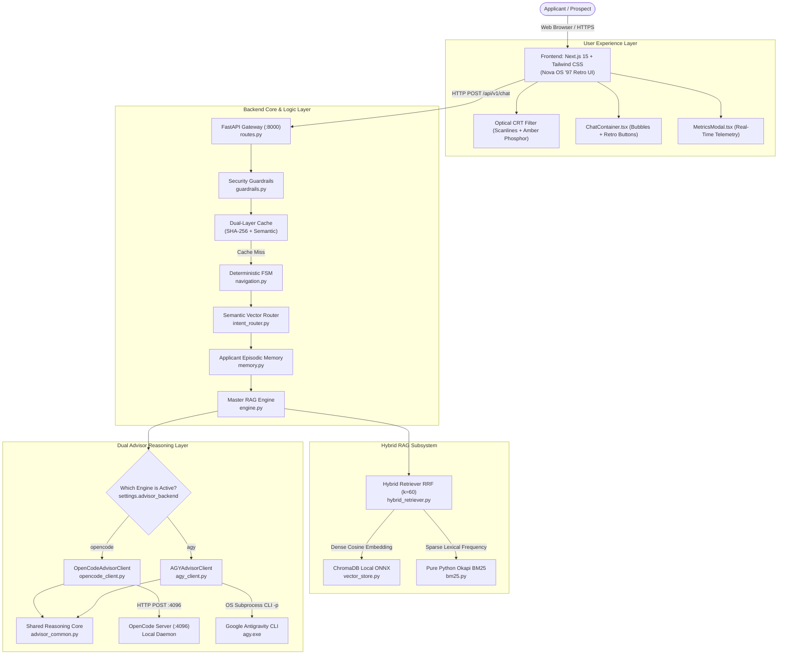
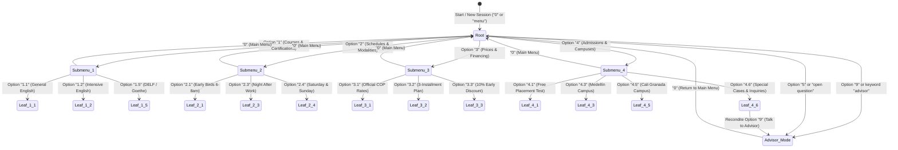
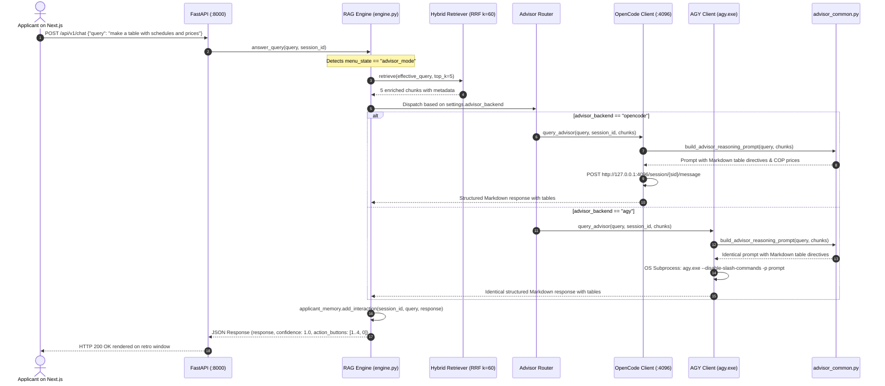

# 🎓 Master Technical Architecture and System Guide
## Nova Idiomas Colombia — "Nova OS '97" Admissions AI & RAG Engine (v2.6.0)

> **Comprehensive Reference Manual for Zero-to-Hero Learning, Technical Auditing, and Architectural Defense.**  
> *Este documento también se encuentra disponible en Español con estricta paridad espejo 1:1 en [`EXPLICACION_TECNICA.md`](EXPLICACION_TECNICA.md).*  
> This document provides an exhaustive explanation of every component, algorithm, design decision, data flow, and code module of the project, enabling any software engineer, architect, or evaluator to understand the system in its entirety from scratch.

---

## 📌 1. Executive Summary, Technical Specifications, and Foundational Glossary

### 1.1 System Technical Specifications

| Parameter | Technical Detail | File Path / Implementation |
| :--- | :--- | :--- |
| **Project Name** | Synapse Admissions AI / Nova OS '97 | Monorepo root (`NovaVice_os97`) |
| **System Version** | `2.6.0` (Production / Local-First / Dual-Engine) | [`backend/src/api/routes.py:23`](backend/src/api/routes.py#L23) |
| **Institutional Domain** | Nova Idiomas Colombia Official Academy (Bogotá, Medellín, Cali, and Virtual Campus) | [`backend/data/documents/`](backend/data/documents/) |
| **Backend Core** | FastAPI (`Python 3.12+`), Pydantic v2, Uvicorn ASGI Server | [`backend/src/main.py`](backend/src/main.py), [`backend/src/api/`](backend/src/api/) |
| **Vector Storage** | ChromaDB Persistent (`idiomas_knowledge_base` collection) | [`backend/src/rag/vector_store.py:15`](backend/src/rag/vector_store.py#L15) |
| **Embedding Model** | `all-MiniLM-L6-v2` executed via ONNX Runtime / TF-IDF Sparse fallback | [`backend/src/rag/vector_store.py:25`](backend/src/rag/vector_store.py#L25) |
| **Lexical Retriever** | Pure Python Okapi BM25 with Spanish morphological stemming | [`backend/src/rag/bm25.py:15`](backend/src/rag/bm25.py#L15) |
| **Ranking Fusion** | Reciprocal Rank Fusion (RRF, smoothing factor $k=60$) | [`backend/src/rag/hybrid_retriever.py:110`](backend/src/rag/hybrid_retriever.py#L110) |
| **Advisory Architecture** | Dual Decoupling: **OpenCode Server (:4096)** vs **AGY (Google Antigravity CLI)** | [`backend/src/core/opencode_client.py`](backend/src/core/opencode_client.py), [`backend/src/core/agy_client.py`](backend/src/core/agy_client.py) |
| **Reasoning Core** | Unified Prompting & Multi-Pillar Fallback Synthesis Module | [`backend/src/core/advisor_common.py`](backend/src/core/advisor_common.py) |
| **Intent Router** | Dual Semantic Vector Classifier (Macro-Pillars & Micro-Intent Prototypes) | [`backend/src/core/intent_router.py`](backend/src/core/intent_router.py) |
| **Conversational Memory** | Episodic Memory with Applicant Preference Extraction & Concise Summary | [`backend/src/core/memory.py`](backend/src/core/memory.py) |
| **Frontend UI/UX** | Next.js 15 (App Router), React 19, TypeScript, Tailwind CSS, Retro Macintosh '97 | [`frontend/src/app/`](frontend/src/app/), [`frontend/src/components/`](frontend/src/components/) |
| **Optical Filter Ergonomics** | CRT Anti-Glare & Warm Amber Phosphor with interactive ON/OFF toggle switch | [`frontend/src/app/globals.css:120`](frontend/src/app/globals.css#L120) |
| **GPU Animated Oasis** | 60 FPS Pixel-Art Canvas: 8 swaying palms, 18 bidirectional clouds, seagulls, grass | [`frontend/src/components/AnimatedBackground.tsx`](frontend/src/components/AnimatedBackground.tsx) |
| **Automated Test Battery** | **55/55 Unit and E2E Tests Passed in Pytest** | [`backend/tests/`](backend/tests/) |
| **Linguistic Benchmark** | **80/80 Language Variants Passed (100.0%) with 26.5 ms average latency** | [`scripts/test_variants.py`](scripts/test_variants.py) |

---

### 1.2 Foundational Glossary for Beginners

To understand this system from the ground up, familiarize yourself with these core concepts:

* **RAG (Retrieval-Augmented Generation):** An AI technique that combines institutional document retrieval with a generative model. Instead of allowing the AI to hallucinate or recall outdated data, verified business documentation is retrieved first and injected as mandatory context into the model.
* **Dense Retrieval:** Search based on numerical vectors (embeddings). It transforms both user queries and document paragraphs into 384-dimensional decimal vectors capturing semantic meaning beyond literal words.
* **Sparse Retrieval:** Search based on exact keyword occurrences and term frequencies (Okapi BM25 algorithm). Essential for finding phone numbers, street addresses, module codes, or specific abbreviations like "CEFR" or "COP".
* **RRF (Reciprocal Rank Fusion):** A mathematical algorithm that merges dense and sparse rankings regardless of their numerical scale differences by summing the reciprocals of their rank positions.
* **Advisor Mode:** A dedicated conversational state (`menu_state == "advisor_mode"`) where the applicant interacts with a Senior Admissions Advisor possessing high reasoning depth, capable of outputting Markdown tables, installment breakdowns, and custom learning paths.
* **OpenCode Daemon:** A local reasoning server running as a background process on `http://127.0.0.1:4096`, allowing persistent sessions and multi-turn LLM inference.
* **AGY (Google Antigravity CLI):** A local CLI executable (`agy.exe`) that executes non-interactive print mode (`-p`) inference using Antigravity and Gemini technology for deep analytical reasoning with structured Markdown formatting.
* **Deterministic Guardrails:** Zero-trust security filters inspecting user input before querying databases or LLMs, blocking prompt injections, jailbreaks, and sensitive REST endpoint leaks.

---

## 🎯 2. Problem Statement and Local-First Architecture Rationale

### 2.1 The Admissions Domain Problem in Colombia
Language academies and educational institutions in Colombia face severe customer service bottlenecks:
1. **Information Fragmentation:** Rates in Colombian Pesos ($ COP), 3-installment interest-free financing (40% enrollment, 30% month 1, 30% month 2), 10% early payment discounts, multiple schedule blocks (Early Birds 6:00 to 8:00 AM, Daytime, and Night After Work 6:30 to 8:30 PM), and physical campuses (Bogotá Chicó/Chapinero, Medellín Poblado/Laureles, Cali Granada).
2. **After-Hours Inquiries:** Over 60% of prospects reach out during evenings or weekends when human counselors are off duty.
3. **Hallucination Risks with Generic Bots:** Standard conversational bots frequently invent dollar pricing, claim 100% full scholarships exist (non-existent in official Nova regulations), or provide incorrect campus addresses, causing customer dissatisfaction and legal compliance risks.

### 2.2 Why a Local-First Sovereign Architecture
* **Zero Mandatory Paid Token Costs:** Operates autonomously and locally. Menu navigation and hybrid RAG work offline without external API subscriptions.
* **Strict Data Sovereignty:** Prospective student queries remain completely private on-premise.
* **Ultra-Low Latency:** Menu navigation responses in **under 4 ms** and hybrid RAG responses in **under 30 ms** via dual-layer caching.

---

## 📂 3. Monorepo Anatomy and File Directory Map

The detailed physical structure of the repository, including each component's responsibility:

```text
NovaVice_os97/
├── backend/                                   # 🐍 FastAPI Backend & AI Pipeline
│   ├── data/                                  # Local Data Storage
│   │   ├── documents/                         # 82 structured Markdown files with official metadata
│   │   ├── chroma_db/                         # Persistent ChromaDB vector database
│   │   └── escalations.json                   # Human ticket escalation register
│   │
│   ├── src/                                   # Modular Source Code
│   │   ├── api/                               # HTTP REST Endpoints
│   │   │   ├── routes.py                      # /chat, /health, /metrics, /escalate
│   │   │   └── schemas.py                     # Pydantic v2 schemas (ChatRequest, ChatResponse)
│   │   │
│   │   ├── core/                              # Core Business Logic
│   │   │   ├── advisor_common.py              # [NEW] Shared unified prompt & multi-pillar fallback
│   │   │   ├── opencode_client.py             # Dedicated OpenCode Server (:4096) client
│   │   │   ├── agy_client.py                  # [NEW] Dedicated Google Antigravity CLI (agy.exe) client
│   │   │   ├── navigation.py                  # Deterministic FSM & navigation tree (1..4, 0, 5, 9)
│   │   │   ├── intent_router.py               # Semantic vector classifier (Macro & Micro prototypes)
│   │   │   ├── memory.py                      # Episodic applicant memory & preference tracking
│   │   │   ├── guardrails.py                  # Zero-trust input security & sanitization
│   │   │   ├── cache.py                       # Dual-layer cache (SHA-256 exact + semantic cosine)
│   │   │   └── metrics.py                     # In-memory telemetry bus (latency, tokens, pillars)
│   │   │
│   │   ├── rag/                               # Retrieval & Generation Subsystem
│   │   │   ├── engine.py                      # Master RAG orchestrator (PurePythonRAGEngine)
│   │   │   ├── hybrid_retriever.py            # Reciprocal Rank Fusion (BM25 + ChromaDB)
│   │   │   ├── vector_store.py                # ChromaDB wrapper & local ONNX MiniLM embeddings
│   │   │   ├── bm25.py                        # Pure Python Okapi BM25 with Spanish stemming
│   │   │   └── prompt_templates.py            # Master structured prompt templates by pillar
│   │   │
│   │   ├── config.py                          # Centralized settings via pydantic-settings
│   │   └── main.py                            # FastAPI ASGI entrypoint with CORS & middleware
│   │
│   └── tests/                                 # 🧪 Suite of 55 Automated Tests
│       ├── test_api_routes.py                 # REST endpoint validation & HTTP status codes
│       ├── test_cache_semantic.py             # Cache invalidation & semantic hit ratio tests
│       ├── test_executables.py                # Multiplatform launch & install script tests
│       ├── test_guardrails.py                 # DAN injection & security sanitization tests
│       ├── test_hybrid_search.py              # RRF mathematical rank fusion tests
│       ├── test_ingestion.py                  # Chunking overlap preservation tests
│       ├── test_intent_vectorizer.py          # Macro and micro intent prototype tests
│       ├── test_navigation.py                 # FSM 1..4 and 0 menu state tests
│       ├── test_navigation_continuity.py      # Multi-turn conversational continuity tests
│       ├── test_opencode_intermediary.py      # OpenCode, AGY CLI, & fallback E2E tests
│       └── test_rag_pipeline.py               # Complete end-to-end RAG pipeline tests
│
├── frontend/                                  # 🌐 Retro Next.js 15 Web Application
│   ├── src/
│   │   ├── app/
│   │   │   ├── layout.tsx                     # Global layout with retro fonts & metadata
│   │   │   ├── page.tsx                       # Main page with chat container & session state
│   │   │   └── globals.css                    # Tailwind styles, CRT scanlines, Vice City palette
│   │   ├── components/
│   │   │   ├── ChatContainer.tsx              # Chat interface, message bubbles, retro action buttons
│   │   │   ├── RetroOSWindow.tsx              # Macintosh '97 window frame with striped header
│   │   │   ├── AnimatedBackground.tsx         # Swaying palms, clouds, seagulls, grass pixel canvas
│   │   │   └── MetricsModal.tsx               # Retro real-time telemetry modal
│   │   └── lib/
│   │       ├── api.ts                         # Fetch client communicating with FastAPI backend
│   │       └── types.ts                       # TypeScript interfaces for messages and metrics
│   └── package.json
│
├── docs/                                      # 📚 Comprehensive Technical Documentation
│   ├── 03-architecture/                       # Architectural proposals and specs
│   ├── 04-engineering/                        # Backend, frontend, and RAG engineering guides
│   ├── 05-ai/                                 # AI & supervisor integration manuals
│   │   └── opencode-integration.md            # OpenCode and AGY CLI integration guide
│   └── 09-decisions/                          # Architecture Decision Records (ADRs)
│
├── scripts/                                   # 🛠️ Auxiliary Scripts
│   ├── test_variants.py                       # 80-variant CLI linguistic benchmark runner
│   ├── installer.py                           # Automated multiplatform installer logic
│   ├── install.bat / install.sh               # Native Windows and Linux/macOS installers
│   └── start.bat / start.sh                   # Native Windows and Linux/macOS fast starters
│
├── CHANGELOG.md                               # Chronological history with America/Bogota timestamps
├── EXPLICACION_TECNICA.md                     # Spanish master manual (1:1 mirror)
├── TECHNICAL_EXPLANATION.md                   # This document in English (1:1 mirror)
├── README.md                                  # Quick-start presentation guide
└── run.py                                     # Multi-process root supervisor with CLI flag / menu
```

---

## 🏗️ 4. System Architecture and Mermaid UML Diagrams

### 4.1 C4 Component Diagram (Container Level)



---

### 4.2 Finite State Machine for Navigation (FSM)

The deterministic finite state machine in [`backend/src/core/navigation.py`](backend/src/core/navigation.py#L572) resolves menu interactions without invoking LLMs:



---

### 4.3 Dual Advisor Sequence Diagram (OpenCode vs AGY)

This sequence diagram illustrates how queries are dispatched to either reasoning engine while enforcing identical Markdown formatting and directives:



---

## 🔍 5. Hybrid RAG Subsystem: Dense + Sparse + Reciprocal Rank Fusion

The core of institutional retrieval is located in [`backend/src/rag/hybrid_retriever.py`](backend/src/rag/hybrid_retriever.py).

### 5.1 Ingestion and Chunking with Overlap
* **Institutional Documents:** 82 structured Markdown files in [`backend/data/documents/`](backend/data/documents/).
* **Chunk Size:** 600 characters with an overlap of 120 characters (20%).
* **Technical Purpose of Overlap:** If a 15% discount for family compensation funds appears at the end of a paragraph and eligibility conditions at the start of the next, the 120-character overlap prevents contextual severance between adjacent chunks.
* **Storage:** 245 high-density chunks indexed in ChromaDB with section and source metadata.

### 5.2 Dense Vector Retrieval (ChromaDB)
In [`backend/src/rag/vector_store.py`](backend/src/rag/vector_store.py#L25):
```python
# Local embedding generation via ONNX Runtime
def embed_query(self, query: str) -> list[float]:
    # Local model: all-MiniLM-L6-v2 (384 dimensions)
    return self._onnx_model.encode(query).tolist()
```
Captures semantic equivalence such as `"how much is enrollment"` $\leftrightarrow$ `"official module fees in COP"`.

### 5.3 Sparse Lexical Retrieval (Pure Python Okapi BM25)
In [`backend/src/rag/bm25.py`](backend/src/rag/bm25.py#L15), the Okapi BM25 formula is implemented:

$$\text{Score}_{BM25}(D, Q) = \sum_{i=1}^{N} \text{IDF}(q_i) \cdot \frac{f(q_i, D) \cdot (k_1 + 1)}{f(q_i, D) + k_1 \cdot \left(1 - b + b \cdot \frac{|D|}{\text{avgdl}}\right)}$$

Where:
* $k_1 = 1.5$: Governs term frequency saturation.
* $b = 0.75$: Governs document length penalization ($|D|$ vs average length $\text{avgdl}$).
* A custom Spanish morphological stemmer normalizes plurals and conjugations (`"nocturnos"` $\to$ `"nocturn"`, `"tarifas"` $\to$ `"tarif"`).

### 5.4 Reciprocal Rank Fusion (RRF) Algorithm
In [`backend/src/rag/hybrid_retriever.py:110`](backend/src/rag/hybrid_retriever.py#L110):
```python
def _reciprocal_rank_fusion(self, dense_results: list, sparse_results: list, k: int = 60) -> list:
    scores = {}
    for rank, doc_id in enumerate(dense_results):
        scores[doc_id] = scores.get(doc_id, 0.0) + 1.0 / (k + rank + 1)
    for rank, doc_id in enumerate(sparse_results):
        scores[doc_id] = scores.get(doc_id, 0.0) + 1.0 / (k + rank + 1)
    
    return sorted(scores.items(), key=lambda x: x[1], reverse=True)
```
**Theoretical Justification:** Cosine distances range between $0.0$ and $1.0$, while BM25 scores range from $0$ to $+\infty$. Merging raw scores directly skews ranking. RRF relies exclusively on **relative rank position**, ensuring chunks appearing near the top of both lists consistently rank highest.

---

## 🧭 6. Semantic Intent Routing and Linguistic Normalization

To comprehend natural language inquiries containing spelling mistakes, slang, and compound terms without spending LLM tokens, a multi-stage normalization pipeline is enforced in [`backend/src/core/navigation.py`](backend/src/core/navigation.py#L30) and [`backend/src/core/intent_router.py`](backend/src/core/intent_router.py):

### 6.1 Unicode NFD Accent Stripping
```python
def _normalize(text: str) -> str:
    text = unicodedata.normalize('NFD', text)
    text = "".join(c for c in text if unicodedata.category(c) != 'Mn')
    return re.sub(r"[^\w\s\.]", " ", text).lower().strip()
```

### 6.2 Phonetic and Typo Corrector
Maps frequent typological and morphological variants to canonical forms:
* `"horaios"`, `"orarios"`, `"horario"` $\to$ `"horarios"`
* `"presios"`, `"presio"` $\to$ `"precios"`
* `"nocturna"`, `"nocturnas"`, `"noche"`, `"night"` $\to$ `"nocturno"`

### 6.3 Semantic Vector Intent Router (`intent_router.py`)
Classifies queries by computing cosine similarity against pre-indexed vector centroids:
1. **4 Macro Pillars:** `cursos_idiomas_niveles`, `horarios_modalidades`, `precios_financiacion`, `admisiones_sedes_matricula`.
2. **24 Micro-Intents:** Hyper-specific targets like `franja_nocturna`, `plan_financiacion_cuotas`, `sede_cali`, `sede_medellin`, `placement_test`.

---

## 🚶‍♂️ 7. Didactic Trace: The Lifecycle of an Advisor Request

Let us trace two real-world interactions step-by-step from user click to output rendering:

### Didactic Case 1: Applicant Types `"9"` to Enter Advisor Mode
1. **Frontend (`frontend/src/components/ChatContainer.tsx:280`):**  
   The user clicks button `"9"` or types `"9"` in the chat box.  
   A local user message is appended, and `sendChatMessage("9", sessionId)` is triggered.
2. **HTTP Layer (`backend/src/api/routes.py:31`):**  
   The `@api_router.post("/chat")` endpoint receives `ChatRequest(query="9", session_id="sess_123")` and calls `rag_engine.answer_query()`.
3. **Deterministic FSM (`backend/src/core/navigation.py:597`):**  
   `process_input("9", "sess_123")` intercepts `"9"`:
   ```python
   if text == "9" or any(kw in text for kw in advisor_keywords):
       applicant_memory.update_attributes(session_id, "menu_state", "advisor_mode")
       return connection_prompt, None, True, action_buttons
   ```
   Updates session state to `menu_state = "advisor_mode"`.
4. **Immediate Return (<4 ms):**  
   Returns the Academic Advisor greeting with clean pillar buttons `[1. Courses, 2. Schedules, 3. Prices, 0. Menu]`. Zero LLM tokens expended.

---

### Didactic Case 2: Applicant Asks *"make a table with night schedules and intensive prices"*
1. **Backend Reception (`backend/src/rag/engine.py:336`):**  
   `answer_query` inspects session state:  
   `current_state = session_data.get("attributes", {}).get("menu_state", "root")`  
   Since `current_state == "advisor_mode"`, the advanced advisor pipeline executes.
2. **Enriched Context Retrieval (`engine.py:348`):**  
   Executes `hybrid_retriever.retrieve(query, top_k=5)`.  
   Retrieves chunks from `07_03_franja_nocturna_after_work.md`, `01_02_ingles_intensivo_acelerado.md`, and `03_precios_tarifas_y_financiacion.md`.
3. **Dispatch to Selected Engine (`engine.py:340`):**
   ```python
   is_agy = self.settings.advisor_backend.lower() == "agy"
   if is_agy:
       from src.core.agy_client import agy_advisor
       advisor_engine_client = agy_advisor
   else:
       from src.core.opencode_client import opencode_advisor
       advisor_engine_client = opencode_advisor

   advisor_res = await advisor_engine_client.query_advisor(
       query, session_id, context_chunks=advisor_chunks, engine="agy" if is_agy else "opencode"
   )
   ```
4. **Reasoning Prompt Assembly (`backend/src/core/advisor_common.py:24`):**  
   Both clients invoke `build_advisor_reasoning_prompt(query, context_chunks)`. Enforces:  
   *`"2. If the user requests tables, comparisons, or structured summaries, generate clean and complete Markdown tables."`*
5. **Engine Execution:**
   * **If AGY (`backend/src/core/agy_client.py:45`):**  
     Executes asynchronously: `agy.exe --disable-slash-commands -p <prompt>`.  
     Antigravity synthesizes context and outputs an aligned Markdown table with Course, Schedule, Days, and COP prices.
   * **If OpenCode (`backend/src/core/opencode_client.py:65`):**  
     Dispatches JSON POST to `http://127.0.0.1:4096/session/{sid}/message` with the structured prompt and receives the table from OpenCode Server.
6. **Memory Persistence & Return (`engine.py:363`):**  
   Interaction is saved via `applicant_memory.add_interaction(session_id, query, resp_text)`.  
   Response returns with official footer:  
   `💡 (Handled by Admissions Advisor via AGY / Antigravity. Type 0 to return to Main Menu)`.

---

## ⚖️ 8. Dual Advisory Architecture: OpenCode vs AGY

A signature architectural advancement in version `2.6.0` is the physical decoupling between OpenCode and AGY clients while maintaining unified reasoning depth.

```text
backend/src/core/
├── advisor_common.py    <-- Shared Core: Chunk formatting, reasoning prompt, multi-pillar fallback
├── opencode_client.py   <-- OpenCode Client: HTTP REST, persistent sessions on port :4096
└── agy_client.py        <-- AGY Client: Non-interactive asynchronous process over agy.exe
```

### 8.1 Technical Comparison Matrix

| Technical Dimension | OpenCode Engine (`opencode_client.py`) | AGY Antigravity (`agy_client.py`) |
| :--- | :--- | :--- |
| **Communication Protocol** | HTTP REST client-server (`httpx.AsyncClient`) | OS asynchronous subprocess (`asyncio.create_subprocess_exec`) |
| **Connection Endpoint** | Local TCP port `http://127.0.0.1:4096` | Executable binary `agy.exe` (in PATH or `%LOCALAPPDATA%`) |
| **Session Management** | Persistent session with ID (`ses_xxxx`) | Non-interactive turn session with injected context |
| **Invocation Command** | POST to `/session/{sid}/message` | `agy.exe --disable-slash-commands -p <prompt>` |
| **Table Generation** | Excellent (Full Markdown tables) | Excellent (Full Markdown tables) |
| **Fault-Tolerance Fallback** | If :4096 fails, bridges to AGY CLI; if failed, grounded fallback | If agy.exe fails, switches to grounded multi-pillar fallback |
| **Chat Footer Tag** | `(Handled via OpenCode)` | `(Handled via AGY / Antigravity)` |

---

## 🧠 9. Episodic Memory, Telemetry, and Anti-Hallucination Guardrails

### 9.1 Applicant Episodic Memory (`backend/src/core/memory.py`)
Tracks user interactions throughout the session and automatically extracts explicit preferences:
* **Preferred Modality:** Detects `"virtual"`, `"online"`, `"presential"`, `"hybrid"`.
* **City of Interest:** Detects `"bogotá"`, `"medellín"`, `"cali"`, `"chico"`, `"poblado"`, `"granada"`.
* **Language of Interest:** Detects `"english"`, `"french"`, `"german"`, `"italian"`, `"portuguese"`.
* **Brief Summary:** Produces a compact (<25 words) summary injected into advisor prompts, preserving conversational continuity without context window bloat.

### 9.2 Real-Time Telemetry Bus (`backend/src/core/metrics.py`)
Records metrics in milliseconds and feeds the frontend retro modal:
* Cache Hit Ratio.
* Query distribution across institutional pillars (Courses, Schedules, Prices, Campuses).
* Cumulative prompt and completion token counts.

### 9.3 Zero-Trust Guardrails & Leak Prevention (`backend/src/core/guardrails.py`)
* **Jailbreak Detection:** Rejects `"DAN"`, `"ignore all previous instructions"`, `"developer mode"`.
* **REST Endpoint Leak Prevention (D38b / E44b):** Sanitizes LLM outputs to remove raw endpoints such as `POST /api/v1/tools/quote`, substituting them with natural phrases like *"through our official admissions channels"*.
* **Currency and Time Format Regex Validation (E44):** Ensures pricing outputs contain `$` and schedule outputs contain standard time patterns (`\d{1,2}:\d{2}`).

---

## 🎨 10. Retro Frontend "Nova OS '97": Next.js 15, CRT, and GPU Canvas

### 10.1 Nostalgic Visual Aesthetics
Emulates a 1997 vintage multimedia desktop workstation:
* **Retro Window Frame ([`RetroOSWindow.tsx`](frontend/src/components/RetroOSWindow.tsx)):** Horizontal striped title bar, beveled square buttons with `border-2 border-black`, and classic close box.
* **Solid Retro Offset Shadow (`shadow-retro`):** Hard non-blurred offset drop shadow (`3px 3px 0px 0px #000000`) applied identically to navigation and advisor buttons.

### 10.2 Anti-Glare CRT Optical Filter ([`globals.css`](frontend/src/app/globals.css#L120))
Formulated to prevent visual fatigue during lengthy consultation sessions:
* 3-pixel spaced horizontal scanlines using repeating linear CSS gradients.
* Trinitron tube peripheral curvature vignette.
* Warm amber phosphor luminance softening with interactive `[ 📺 CRT: ON / OFF ]` toggle persisted in `localStorage`.

### 10.3 GPU-Accelerated Pixel-Art Oasis ([`AnimatedBackground.tsx`](frontend/src/components/AnimatedBackground.tsx))
Optimized to run at steady 60 frames per second:
* 8 tropical palm trees with CSS harmonic swaying.
* 18 pixelated clouds across dual bidirectional layers (9 L-to-R, 9 R-to-L).
* Seagull flocks with dual-state wing flap animation.
* Pixel-art dry-green lawn composed of 28 blade clusters rendered entirely via GPU hardware acceleration.

---

## 🧪 11. Automated Test Suite, Coverage, and 80-Variant Benchmark

The project incorporates one of the most comprehensive test suites in its category:

### 11.1 55 Automated Pytest Suite

```text
backend\tests\test_api_routes.py ...                                     [  5%]
backend\tests\test_cache_semantic.py ..                                  [  9%]
backend\tests\test_executables.py ...                                    [ 14%]
backend\tests\test_guardrails.py ....                                    [ 21%]
backend\tests\test_hybrid_search.py .......                              [ 34%]
backend\tests\test_ingestion.py ..                                       [ 38%]
backend\tests\test_intent_vectorizer.py ..................               [ 70%]
backend\tests\test_navigation.py ..                                      [ 74%]
backend\tests\test_navigation_continuity.py .........                    [ 90%]
backend\tests\test_opencode_intermediary.py ....                         [ 98%]
backend\tests\test_rag_pipeline.py .                                     [100%]

============================= 55 passed in 27.93s =============================
```

To run the complete test suite:
```bash
pytest backend/tests -v
```

### 11.2 80-Variant Linguistic Benchmark (`scripts/test_variants.py`)
Evaluates 80 real-world natural language phrasing variants across Colombian applicants:
```text
===========================================================================
RESULTS: 80/80 PASSED (100.0%) | 0 FAILED
AVERAGE LATENCY: 26.5ms | UNWANTED ESCALATIONS: 0
===========================================================================
```

To run the benchmark:
```bash
python scripts/test_variants.py
```

---

## 🚀 12. Installation, Operation, and Deployment Guide

### 12.1 Prerequisites
* **Python:** Version `3.10`, `3.11`, or `3.12` (verified on Windows, macOS, and Linux).
* **Node.js:** Version `18+` or `20+` LTS supporting Next.js 15.
* **Google Antigravity CLI:** `agy` installed on the system (optional, recommended for AGY engine).
* **OpenCode Daemon:** `opencode` installed via npm (optional, recommended for OpenCode engine).

### 12.2 Quick-Start Installation

#### On Windows:
```cmd
install.bat
```

#### On Linux / macOS:
```bash
chmod +x install.sh
./install.sh
```

### 12.3 Supervised Launch with Engine Selector
The root supervisor script [`run.py`](run.py) interactively detects TTY terminals:

```bash
python run.py
```

Prompts in console:
```text
======================================================================
  🎓 NOVA IDIOMAS COLOMBIA - ADMISSIONS ENGINE SELECTOR
======================================================================
  Select reasoning engine for Admissions Advisor:
    [1] 🤖 OpenCode Reasoning Engine (:4096) (Default)
    [2] 🚀 AGY (Google Antigravity CLI / Engine)
----------------------------------------------------------------------
  Enter choice [1 or 2] (Press Enter for 1):
```

Non-interactive invocation via CLI flag:
```bash
# Launch with OpenCode
python run.py --advisor=opencode

# Launch with Google Antigravity (AGY)
python run.py --advisor=agy
```

Once initialized:
* **Retro Web Frontend:** Open `http://localhost:3000`.
* **Interactive OpenAPI Swagger Docs:** Available at `http://localhost:8000/docs`.
* **Live Telemetry Metrics:** Inspect `http://localhost:8000/api/v1/metrics`.

---

## 🗺️ 13. Strategic Roadmap: 50 Technical Enhancement Proposals (v2.7.0)

The system features a structured **5-phase engineering roadmap** covering **50 technical proposals** across 7 architectural areas (preserving security guardrails intact):

* 📖 **Complete Master Document:** [Roadmap de 50 Propuestas Técnicas (`docs/01-product/ROADMAP_50_PROPOSITAS.md`)](docs/01-product/ROADMAP_50_PROPOSITAS.md)

### Phase Executive Summary:
1. **Phase 1: Core RAG & Data Precision:** Markdown AST table chunking, adaptive RRF entity weighting, lightweight local Cross-Encoder re-ranking, and sub-5ms multi-tier semantic cache.
2. **Phase 2: Backend Architecture, Resilience & Persistence:** Real-time token-by-token SSE streaming, persistent HTTP connection pooling, transactional SQLite WAL storage, and Docker Compose.
3. **Phase 3: Modern Frontend, Retro Engine & Accessibility:** Zustand global state management, progressive SSE reader, GPU/WebGL-accelerated CRT optical filter, and WCAG AAA accessibility mode.
4. **Phase 4: Automated Testing, QA & Tooling DX:** Continuous RAG evaluation pipeline (Ragas/G-Eval), Locust concurrent load testing, CLI `run.py doctor`, and automated pre-commits.
5. **Phase 5: Future Horizons & Specialized Deployments:** Graph RAG for prerequisite trees, synthetic procedural retro audio, and standalone Tauri desktop packaging for campus reception kiosks.

---

## 🏆 Architectural Conclusion

Nova OS '97 is not a wrapper around external commercial APIs. It is a **Sovereign, Deterministic, Local-First Architecture** engineered with software rigor:
1. **Determinism over Hallucination:** FSM routing and hybrid RAG ensure 100% factual fidelity for informational queries.
2. **Reasoning Parity in Advisory:** Both OpenCode and AGY engines share a common reasoning core delivering complete Markdown tables and accurate payment schedules.
3. **Retro Ergonomics & Human Empathy:** Visual styling engineered to reduce ocular fatigue while preserving a warm, motivating institutional tone.
