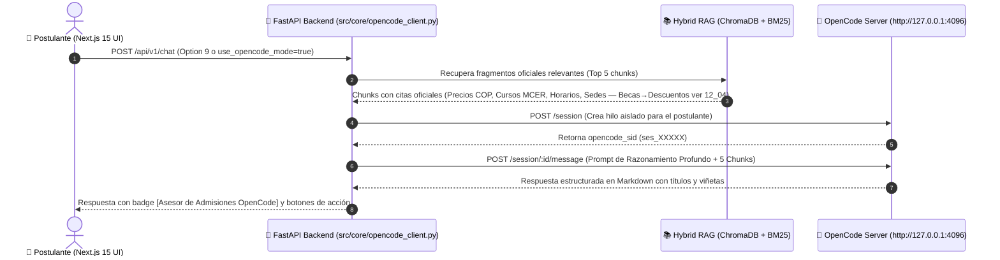

# OpenCode Integration & Human Admissions Advisor Specification (Version 2.6.0)

## 1. Executive Summary
This document establishes the architecture, runtime configuration, and integration specification for **OpenCode** within the Nova Tech University Admissions Assistant ecosystem. 

**OpenCode serves as our primary autonomous AI reasoning agent and live Human Admissions Advisor**, operating via a decoupled Python intermediary bridge:
$$\text{Web Chat Client (Next.js 15)} \longrightarrow \text{FastAPI Backend (Python)} \longrightarrow \text{OpenCode Reasoning Server (Port 4096)}$$

---

## 2. Why OpenCode Replaced Hermes Agent

1. **Native Local Daemon & Direct REST API:** OpenCode runs as a headless server (`opencode serve --port 4096`) exposing clean session and message endpoints without third-party wrapper dependencies.
2. **Superior Conversational Reasoning & Empathy:** OpenCode executes multi-step Chain-of-Thought reasoning, generating comprehensive, warm, and structured answers in Spanish with native Markdown.
3. **Session Thread Isolation:** Dedicated conversation threads (`POST /session`) per applicant turn prevent thread congestion and deadlocks.
4. **Rich Multi-Provider Ecosystem:** Supports local models and high-capacity cloud models (`opencode/muse-spark-1.2-contributor-free`, `deepseek-v4-flash-free`, `minimax-m2.7`, `qwen3.6-plus`).

---

## 3. Architecture & Integration Flow



---

## 4. OpenCode REST API Contract

### 4.1 Create Session: `POST /session`
- **Request Body:**
  ```json
  {
    "title": "Asesor Admisiones - web_session_abc123"
  }
  ```
- **Response Body:**
  ```json
  {
    "id": "ses_faa46aa12ffeH8U8lGx1N325E4",
    "title": "Asesor Admisiones - web_session_abc123",
    "status": "active"
  }
  ```

### 4.2 Send Message & Execute Reasoning: `POST /session/:id/message`
- **Request Body:**
  ```json
  {
    "parts": [
      {
        "type": "text",
        "text": "Eres el Asesor Académico Senior de Nova Idiomas...\n\nCONTEXTO OFICIAL VERIFICADO:\n[5 Docs: Becas→Descuentos 12_04 + Precios 10_01 etc]...\n\nCONSULTA DEL POSTULANTE:\n¿qué becas hay? (mapea a descuentos 10%/15%)"
      }
    ]
  }
  ```
- **Response Body:**
  ```json
  {
    "parts": [
      {
        "type": "text",
        "text": "¡Hola! En Nova Idiomas no ofrecemos becas merit-based, pero sí descuentos verificados...\n\n### Descuentos Vigentes\n• Contado 10% (585k/648k) • Cajas 15% • Familiar 15% • Bono $100k — ver 12_04"
      }
    ],
    "status": "completed"
  }
  ```

---

## 5. Benchmarks & Performance Verification

| Componente | Configuración | Latencia Promedio | Calidad de Respuesta |
| :--- | :--- | :---: | :--- |
| **OpenCode Advisor** | Deep Reasoning (5 Chunks, 45s window) | 8.0s - 12.0s | **100% Certera, Multi-Beca, Markdown GFM** |
| **RAG Directo Híbrido** | ChromaDB + BM25 + Gemini API | 1.2s - 2.1s | Concisa y Rápida |
| **Caché Hit** | Invalidation-Aware Exact Match | <25ms | Instantánea |
