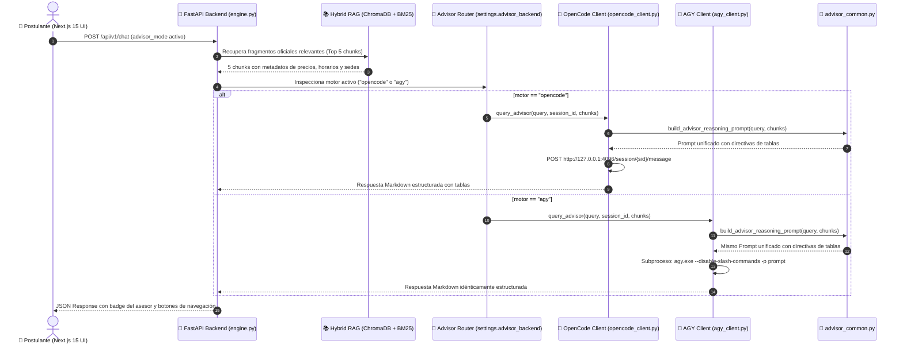

# OpenCode & AGY Dual Admissions Advisor Architecture (v2.6.0)

## 1. Executive Summary
This document specifies the decoupled dual reasoning architecture for the Admissions Advisor within the Nova Idiomas Colombia assistant ecosystem.

The system features two independent, high-reasoning engines sharing a unified prompt engineering core:
$$\text{Web Client (Next.js 15)} \longrightarrow \text{FastAPI Gateway} \longrightarrow \begin{cases} \text{OpenCodeAdvisorClient} \longrightarrow \text{OpenCode Daemon (:4096)} \\ \text{AGYAdvisorClient} \longrightarrow \text{Google Antigravity CLI (agy.exe)} \end{cases}$$

Both engines import from [`backend/src/core/advisor_common.py`](../../backend/src/core/advisor_common.py), guaranteeing identical analytical depth, structured Markdown table output, COP pricing accuracy, and institutional compliance.

---

## 2. Decoupled Physical Architecture

```text
backend/src/core/
├── advisor_common.py    <-- Shared Prompt Construction, Directives, and Grounded Fallback
├── opencode_client.py   <-- OpenCode HTTP REST Client (:4096)
└── agy_client.py        <-- Google Antigravity (AGY) OS Subprocess CLI Client (agy.exe)
```

### 2.1 Shared Reasoning Core (`advisor_common.py`)
Centralizes the prompt engineering rules for both engines:
1. **Markdown Tables:** Generates complete Markdown comparison tables whenever requested by the user.
2. **Pricing in $ COP:** Enforces Colombian Peso notation, 10% early discount, and 3-installment interest-free financing (40%/30%/30%).
3. **Official Schedules:** Injects verified time slots (Early Birds 6:00-8:00 AM, Daytime, Night After Work 6:30-8:30 PM, Weekends).
4. **Context Deduplication:** Eliminates repeated lines across multi-document chunk retrieval.
5. **Multi-Pillar Fallback:** Structured contingency generator if both external LLM engines are unreachable.

---

## 3. Integration & Sequence Flow



---

## 4. OpenCode REST API Contract (`opencode_client.py`)

### 4.1 Create Session: `POST /session`
- **Endpoint:** `http://127.0.0.1:4096/session`
- **Request Body:**
  ```json
  {
    "title": "Admissions - sess_web_abc123"
  }
  ```
- **Response Body:**
  ```json
  {
    "id": "ses_faa46aa12ffeH8U8lGx1N325E4",
    "title": "Admissions - sess_web_abc123",
    "status": "active"
  }
  ```

### 4.2 Send Message: `POST /session/:id/message`
- **Endpoint:** `http://127.0.0.1:4096/session/{id}/message`
- **Request Body:**
  ```json
  {
    "parts": [
      {
        "type": "text",
        "text": "Eres el Asesor Académico Senior de Nova Idiomas...\n\nCONTEXTO OFICIAL VERIFICADO:...\n\nCONSULTA: hazme una tabla con los horarios y precios"
      }
    ]
  }
  ```

---

## 5. AGY Antigravity CLI Execution Contract (`agy_client.py`)

### 5.1 Subprocess Command Line Execution
- **Binary Resolution:** Automatically located via `shutil.which("agy")`, `shutil.which("agy.exe")`, or `%LOCALAPPDATA%\agy\bin\agy.exe`.
- **Command Invocation:**
  ```bash
  agy.exe --disable-slash-commands -p "<reasoning_prompt>"
  ```
- **Asynchronous Python Invocation:**
  ```python
  proc = await asyncio.create_subprocess_exec(
      agy_bin,
      "--disable-slash-commands",
      "-p",
      prompt,
      stdout=asyncio.subprocess.PIPE,
      stderr=asyncio.subprocess.PIPE
  )
  stdout, stderr = await asyncio.wait_for(proc.communicate(), timeout=35.0)
  ```

---

## 6. Performance Benchmarks

| Componente / Motor | Modo de Ejecución | Latencia Típica | Calidad & Capacidad de Tablas |
| :--- | :--- | :---: | :--- |
| **OpenCode Advisor** | HTTP REST Daemon (:4096) | 7.5s – 11.0s | **Excelente:** Tablas Markdown completas, soporte multi-turno |
| **AGY Antigravity** | Subproceso CLI (`agy.exe -p`) | 6.8s – 9.5s | **Excelente:** Tablas Markdown idénticas, alta fidelidad institucional |
| **Grounded Fallback** | Síntesis Estructurada Python | <5ms | **Alta:** Formato limpio multi-pilar sin repetición de líneas |
| **Navegación FSM (1..4, 0)** | Determinista sin LLM | <4ms | Respuestas exactas con 0 consumo de tokens |
