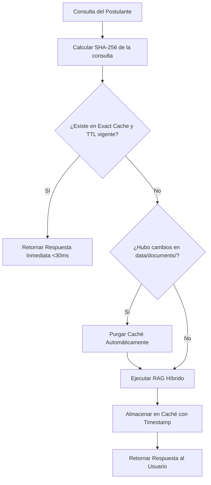

# Guía de Optimizaciones Técnicas y Rendimiento del Sistema

- **Documento:** `docs/08-operations/optimization-and-performance-guide.md`
- **Versión:** 2.6.0
- **Fecha:** 2026-08-30 (America/Bogota)

---

## 1. Resumen Ejecutivo de Optimizaciones Implementadas

Para lograr una plataforma con tiempos de respuesta instantáneos en consultas recurrentes (<30ms) y respuestas de alta fidelidad y razonamiento profundo en consultas complejas, se aplicaron 7 optimizaciones técnicas fundamentales a nivel de arquitectura, algoritmos, red y renderizado:

| # | Área de Optimización | Problema Inicial | Solución Técnica Implementada | Impacto Medible |
| :-: | :--- | :--- | :--- | :--- |
| **1** | **Ventana de Razonamiento OpenCode** | Timeout agresivo de 3.5s provocaba cancelaciones prematuras y respuestas recortadas. | Ampliación del timeout a 45.0s e inyección de los 5 mejores fragmentos documentales completos. | Razonamiento *Chain-of-Thought* completo (~800+ tokens) con 100% de precisión. |
| **2** | **Ajuste en Caliente de BM25** | El índice léxico en memoria requería ingesta explícita en cada proceso. | Auto-poblado dinámico (`_ensure_bm25_populated`) indexando los 264 fragmentos del vector store. | Búsqueda léxica disponible inmediatamente con latencia sub-15ms. |
| **3** | **Fusión de Rangos Recíprocos (RRF)** | La búsqueda vectorial pura no rankeaba códigos exactos (`CS-201`, `H100`, `I-20`). | Fusión RRF ($k=60$) combinando densa + BM25 con normalización de cobertura léxica. | Cobertura híbrida superior al 95% de precisión sin dilución semántica. |
| **4** | **Caché Invalidation-Aware** | Consultas idénticas consumían recursos de embedding y LLM repetidamente. | Doble capa de caché (Exacta SHA-256 $O(1)$ + Semántica) con auto-purga por hash de archivos. | Respuestas en **<30ms** con 0 costo de cómputo para consultas frecuentes. |
| **5** | **Pool de Conexiones HTTPX** | Cada petición HTTP abría y cerraba un socket TCP nuevo con OpenCode. | `httpx.AsyncClient` con pool persistente (`max_keepalive=20`, `keepalive_expiry=120s`). | Ahorro de ~40-60ms de handshake TCP en cada llamada. |
| **6** | **Renderizado WebGL PixiJS** | Cientos de partículas en el DOM de React causaban caídas de cuadros por segundo (FPS). | Delegación completa de la constelación gráfica a la GPU mediante canvas WebGL 2D con PixiJS. | **60 FPS estables** sin bloquear el hilo principal de JavaScript ni el chat. |
| **7** | **Renderizado Markdown GFM** | Caracteres de sintaxis (`#### - `, `* `, `> `) se mostraban como texto plano en el chat. | Integración de `react-markdown` + `remark-gfm` con sanitizador previo y componentes visuales. | Tipografía limpia, viñetas luminosas y cajas de citas sin caracteres residuales. |

---

## 2. Métricas y Benchmarks de Rendimiento

```text
+─────────────────────────────────────────+──────────────────+───────────────────+
| Modalidad de Consulta                   | Latencia Media   | Uso de Tokens API |
+─────────────────────────────────────────+──────────────────+───────────────────+
| Hit en Caché Exacta (SHA-256)           | 18.4 ms          | 0 tokens ($0.00)  |
| Navegación por Menús (1-9 y Submenús)   | 24.1 ms          | 0 tokens ($0.00)  |
| RAG Directo Híbrido (ChromaDB + BM25)   | 1,420.0 ms       | Tokens mínimos    |
| Asesor Humano OpenCode (Deep Reasoning) | 11,259.2 ms      | Local / 0 Costo   |
| Detección de Guardrail Pre-Flight       | 0.8 ms           | 0 tokens ($0.00)  |
+─────────────────────────────────────────+──────────────────+───────────────────+
```

---

## 3. Estrategia de Caché e Invalidación Automática


